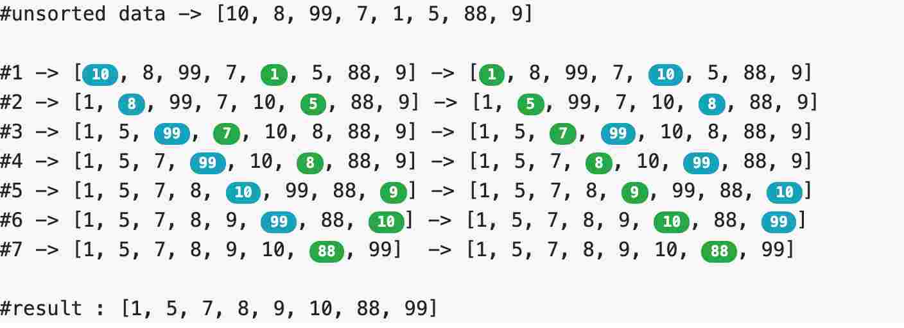

- [Strategy](#strategy)
- [Complexity Analysis](#complexity-analysis)
- [Verdict](#verdict)
- [:bulb: Challenges](#bulb-challenges)
- [Links](#links)


# Strategy

1. Choose the largest/smallest item in the array and place the item in its correct place
2. Choose the next larges/next smallest item in the array and place the item in its correct place.
3. Repeat the process until all items are sorted


<p align="center">
  
</p>

Selection sort is a simple sorting algorithm. This sorting algorithm is an [`in-place comparison-based`](/PlayGround/Playground.md#swap-in-place-numbers) algorithm in which the list is divided into two parts, the sorted part at the left end and the unsorted part at the right end. Initially, the sorted part is empty and the unsorted part is the entire list.

1) The Left End which is already sorted.
2) The Right End which is unsorted.

The smallest element is selected from the unsorted array and swapped with the leftmost element, and that element becomes a part of the sorted array. This process continues moving unsorted array boundary by one element to the right.

`In real life`, this can be explained by picturing how you would sort a deck of cards. Using a shuffled deck, you can go through the cards one by one until you find the lowest card. You set this aside as a new, second pile. You then look for the next-lowest card and once found, you put it at the bottom of the second pile. You repeat this until the first pile is empty.

In every iteration of selection sort, the minimum element (considering ascending order) from the unsorted End is picked and moved to the sorted End.


This algorithm is not suitable for large data sets as its average and worst case complexities are of **O(N<sup>2</sup>)**., where n is the number of items.

<!-- <p align="center">
  
</p> -->


```
public class SelectionSort {

    public void sort(int arr[]){
        System.out.println("Sorting Started...!!!");
    
        for(int i=0;i<arr.length;i++){
            for(int j=i+1;j<arr.length;j++){
                 System.out.println("-------->>  Comparing "+arr[i]+" & "+arr[j]);
                if(arr[i]>arr[j]){
                    System.out.println(+arr[i]+" > "+arr[j]);
                    arr[i]=arr[i]+arr[j];
                    arr[j]=arr[i]-arr[j];
                    arr[i]=arr[i]-arr[j];
                    System.out.println(+arr[i]+" < "+arr[j]);
                    // continue;
                }
            }
        }
    }

    public void printArray(int arr[]){
        for(int i=0;i<arr.length;i++){
            System.out.println(arr[i]);
        }
    }

    public static void main(String[] args) {
        SelectionSort ss = new SelectionSort();
        int arr[] = { 10, 5, 13, 8, 7, 3 ,1,15,9};

        System.out.println("Before Sorting...!!!!");
        ss.printArray(arr);

        ss.sort(arr);

        System.out.println("After Sorting...!!!!");
        ss.printArray(arr);
        
    }
}
```


#   Complexity Analysis


For an array with size n, the external loop will iterate from n‐1 to 1.

```
          for(int i=0;i<arr.length;i++)
  ```

  For each iteration, to find the largest number in subarray, the number of comparison inside the internal loop must is equal to the value of last.

```
        for(int j=i+1;j<arr.length;j++){
```

Therefore the total comparison for Selection Sort in each iteration is (n‐1) + (n‐2) + ….. 2 + 1.

i.e To find the minimum element from the array of  `N` elements, `N-1` comparisons are required. After putting the minimum element in its proper position, the size of an unsorted array reduces to  `N-1` and then `N-2` comparisons are required to find the minimum in the unsorted array.

Therefore   `(N-1)` + `(N-2)` + . . .  + `1`  = `(N.(N-1)/2)` comparisons and `N` swaps result in the overall complexity of **O(N<sup>2</sup>)**.


> **Average Case**
<p align="center">
  
</p>

> **Worst Case**

<p align="center">
  
</p>


# Verdict

- The efficiency of Selection Sort does not depend on the initial arrangement of the data.
- Only appropriate for small n ‐ **O(N<sup>2</sup>)** algorithm
- Time Complexity for Selection Sort is the same for all cases ‐ worse case, best case or average - case O(n<sup>2</sup>).

Selection | Comparison | Swap
---------|----------|---------
 Best Case | **O(N<sup>2</sup>)** | O(N)
 Average Case | **O(N<sup>2</sup>)** | O(N)
 Worst Case | **O(N<sup>2</sup>)** | O(N)


#  :bulb: Challenges
- [ ] [Mobile Numeric Keypad Problem](https://www.geeksforgeeks.org/mobile-numeric-keypad-problem/) or [Old keypad in a foreign land](https://www.hackerearth.com/practice/algorithms/sorting/selection-sort/practice-problems/algorithm/old-keypad-in-a-foreign-land-24/)

- [ ] https://practice.geeksforgeeks.org/problems/selection-sort/1

# Links
- Visualizer - https://www.hackerearth.com/practice/algorithms/sorting/selection-sort/visualize/
