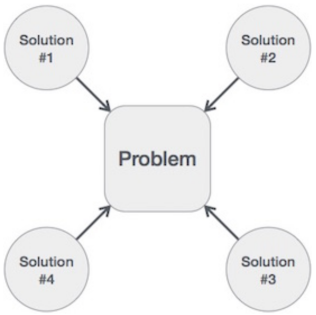

<!-- #   Table Of Contents-  -->
#   :loudspeaker: Hakuna Matata :high_brightness: :tada: <!-- omit in toc -->
- [Data Structures](#data-structures)
  - [a. Characteristics of a Data Structure](#a-characteristics-of-a-data-structure)
  - [b. Need for Data Structure](#b-need-for-data-structure)
  - [c. Execution Time Cases](#c-execution-time-cases)
  - [d. Basic Terminology](#d-basic-terminology)
  - [:bookmark: List Of DataStructures](#bookmark-list-of-datastructures)
  - [:bulb: Choosing the right Data Structure](#bulb-choosing-the-right-data-structure)
- [Algorithms](#algorithms)
  - [a. Characteristics of an Algorithm](#a-characteristics-of-an-algorithm)
  - [b. How to Write an Algorithm?](#b-how-to-write-an-algorithm)
  - [c. Algorithm Analysis](#c-algorithm-analysis)
  - [d. Algorithm Complexity](#d-algorithm-complexity)
    - [i. Space Complexity](#i-space-complexity)
    - [ii. Time Complexity](#ii-time-complexity)
  - [:bookmark: List Of Algorithms](#bookmark-list-of-algorithms)
- [Awesome Links](#awesome-links)
  - [Visualize](#visualize)
  - [Interview](#interview)
  - [References](#references)

<!-- # Algorithms and Data Structures -->
#  Data Structures
**Data Structure** is a systematic way to organize data in order to use it efficiently. Following terms are the foundation terms of a data structure.

-   **Interface** − Each data structure has an interface. Interface represents the set of operations that a data structure supports. An interface only provides the list of supported operations, type of parameters they can accept and return type of these operations.

-   **Implementation** − Implementation provides the internal representation of a data structure. Implementation also provides the definition of the algorithms used in the operations of the data structure.

##  a. Characteristics of a Data Structure
- **Correctness** − Data structure implementation should implement its interface correctly.

- **Time Complexity** − Running time or the execution time of operations of data structure must be as small as possible.

- **Space Complexity** − Memory usage of a data structure operation should be as little as possible.


##  b.  Need for Data Structure
As applications are getting complex and data rich, there are three common problems that applications face now-a-days.

* **Data Search** − Consider an inventory of 1 million items of a store. If the application is to search an item, it has to search an item in 1 million items every time slowing down the search. As data grows, search will become slower.

* **Processor speed** − Processor speed although being very high, falls limited if the data grows to billion records.

* **Multiple requests** − As thousands of users can search data simultaneously on a web server, even the fast server fails while searching the data.

To solve the above-mentioned problems, data structures come to rescue. Data can be organized in a data structure in such a way that all items may not be required to be searched, and the required data can be searched almost instantly.

##   c. Execution Time Cases
There are three cases which are usually used to compare various data structure's execution time in a relative manner.

* **Worst Case** − This is the scenario where a particular data structure operation takes maximum time it can take. If an operation's worst case time is ƒ(n) then this operation will not take more than ƒ(n) time where ƒ(n) represents function of n.

* **Average Case**− This is the scenario depicting the average execution time of an operation of a data structure. If an operation takes ƒ(n) time in execution, then m operations will take mƒ(n) time.

* **Best Case** − This is the scenario depicting the least possible execution time of an operation of a data structure. If an operation takes ƒ(n) time in execution, then the actual operation may take time as the random number which would be maximum as ƒ(n).

##   d. Basic Terminology
* **Data** − Data are values or set of values.

* **Data Item** − Data item refers to single unit of values.

* **Group Items** − Data items that are divided into sub items are called as Group Items.

* **Elementary Items** − Data items that cannot be divided are called as Elementary Items.

* **Attribute and Entity** − An entity is that which contains certain attributes or properties, which may be assigned values.

* **Entity Set** − Entities of similar attributes form an entity set.

* **Field** − Field is a single elementary unit of information representing an attribute of an entity.

* **Record** − Record is a collection of field values of a given entity.

* **File** − File is a collection of records of the entities in a given entity set.


##  :bookmark: List Of DataStructures

`B` - Beginner, `A` - Advanced


- [ ] `B` Linked List
- [ ] `B` Doubly Linked List
- [ ] `B` Queue
- [ ] `B` Stack
- [ ] `B` Hash Table
- [ ] `B` Heap - max and min heap versions
- [ ] `B` Priority Queue
- [ ] `A` Tree
  - [ ] Balanced Tree
    - [ ] `A` Red Black Tree
    - [ ] `A` AVL Tree
    - [ ] `A` Splay Tree
  - [ ] UnBalanced Tree
    - [ ] `A` Binary Search Tree
    - [ ] `A` Trie
  - [ ] `A` Segment Tree - with min/max/sum range queries examples
  - [ ] `A` Fenwick Tree (Binary Indexed Tree)
- [ ] `A` Graph (both directed and undirected)
- [ ] `A` Disjoint Set
- [ ] `A` Bloom Filter


## :bulb: Choosing the right Data Structure 


Data structure is a way how data is stored in the computer. We should choose data structure very wisely else system will not perform well. Below are the bunch of data structures and reasons when to use a specific one.

**1. Arrays** 
```
- Used to store similar kind of elements in contiguous memory. Index based access which normally starts from 0 but can be from 1. 
- We can use Arrays in below cases, 
  - When fast element access is needed (Can be done using the index).  
  - When number of elements i.e size of array is known before hand.  
  - When iterating through all the elements in sequence is needed.  
  - When less memory has to be used. (Arrays take less memory as compared to LinkedList).  
```

**2. Singly Linked List** 
```
- Used to store data in nodes, which are connected to each other and points in one direction. There is no index based access here, so to find an element, we have to traverse the whole linked list. Also, they are not contigous block of memory. Here each node knows the location of next node, which can be located anywhere in the memory. 
- It can be used in below cases,
  - When constant time of insertion and deletion is needed (On head). In middle or on tail, traversing is needed.
  - When data dynamically grows, these are best.
  - When random elements are not needed to be accessed.
  - When insertion is needed at any point in the list.
```

**3. Doubly Linked List** 
```
- Same as singly linked list but pointers at each node points in both the directions. 
- It Can be used in below cases,
  - It's easier to delete the node from doubly linked list.
  - Can be iterated in reverse order without recursion.
  - Insertion or removal from doubly linked list is faster when compared to singly linked list.
```

**4. Circular Linked List** 
```
- Same as singly linked list except the fact that last node again points to first node. 
- It can be used in below cases,
  - Develop the buffer memory.
  - Represent a deck of cards in a game.
  - Browser cache which allows to hit the back button.
  - MRU list (Most recently used list).
  - Undo functionality in photoshop or word.
```

**5. Stack** 
```
- It is used to store data in LIFO form i.e LAST IN FIRST OUT. Think of a stack of plates. 
- It can be used in below cases,
  - Expression evaluation and syntax parsing.
  - Finding the correct path in maze using back tracking.
  - Runtime memory management.
  - Recursion function.
```

**6. Queue** 
```
- It is used to store data in FIFO form i.e FIRST IN FIRST OUT. Think of a queue outside movie theatre. 
- It can be used in below cases,
  - When order is needed.
  - When processing is needed in FIFO order.
  - If we want to add or remove, queue can be used. We can also go with double ended queue in case if operations are needed on both sides.
```

**7. Binary Tree** 
```
- Data Structure where each node has atmost 2 childs. 
- It can be used in below cases, 
  - Find name in the phone book.
  - Sorted traversal of the tree.
  - Find the next closest element.
  - Find all elements less then or greater then certain value.
```

**8. Binary Search Tree (BST)** 
```
- These are similar to binary tree, except of the fact that root node is equal to or greater then the root node of left subtree and less then the root node of right sub tree. 
- It can be used in following cases,
  - They are memory efficient.
  - To be used when data needs to be sorted.
  - Search can be done on range of values.
  - Height balancing helps in reducing the run time.
```

**9. B Tree** 
```
- This keeps data sorted and allows searches, sequential access, insertions, and deletions in logarithmic time. 
- We can use B-Tree in the following use cases,
  - File systems.
  - Database operations.
```

**10. Red Black Tree** 
```
- This is again a kind of binary tree with an extra bit of data per node i.e its color, which can be either red or black. 
- We can use Red-Black Tree in the following use cases,
  - Java Tree Map and C++ map are implemented using Red Black Tree.
  - Computational Geometry Data structures.
  - Scheduler applications.
```

**11. Splay Tree** 
```
- It is a self-adjusting binary search tree with the additional property that recently accessed elements are quick to access again. 
- We can use Splay Tree in the following use cases,
  - When we want to access the recent data easily.
  - Allow duplicate items.
  - Simple implementation and take less memory.
  - When the application deals with a lot of data, use the splay tree.
```

**12. AVL Tree** 
```
- Shape of this tree is constrained at all times such that the tree remains balanced. The height of the tree never exceeds O(log n). 
- We can use AVL Tree in the following use cases,
  - When we want to control the tree height outside -1 to 1 range.
  - Fast looking element.
```

**13. Minimum Spanning Tree** 
```
- A spanning tree of a graph is a subgraph that is a tree and connects all the vertices together. 
- A minimum spanning tree (MST) or minimum weight spanning tree is then a spanning tree with weight less than or equal to the weight of every other spanning tree. 
- We can use Minimum Spanning Tree in the following use cases,
  - Describe financial markets.
  - Handwriting recognition of mathematical expressions.
  - Image registration and segmentation.
  - Constructing trees for broadcasting in computer networks.
```

**14. Trie** 
```
- A Trie (digital tree and sometimes radix tree or prefix tree), is an ordered tree data structure that is used to store a dynamic set or associative array where the keys are usually strings. 
- We can use Trie in the following use cases,
  - Fixed dictionary and want to look up quickly.
  - Require less storage for a large dictionary.
  - Matching sentences during string matching.
  - Predictable O(k) lookup time where k is the size of the key.
  - Lookup can take less than k time if it’s not there.
  - Supports ordered traversal.
  - No need for a hash function.
  - Deletion is straightforward.
```

**15. Heap** 
```
- It is a specialized tree-based abstract data type that satisfies the heap property. 
- We can use Heap in the following use cases,
  - Implement Priority Queue.
  - Whenever we want quick access to the largest (or smallest) item.
  - Good for selection algorithms (finding the min or max).
  - Operations tend to be faster than for a binary tree.
  - Heap sort methods being in-place and with no quadratic worst-case scenarios.
  - Graph algorithms uses heap as internal traversal data structures, run time will be reduced by polynomial order.
```

**16. Hashing** 
```
- It is used to implement an associative array (Hash Map), a structure that can map keys to values. 
- We can use Hash table in the following use cases,
  - Constant time operation.
  - Inserts are generally slow, reads are faster than trees.
  - Hashing is used so that searching a database can be done more efficiently.
  - Internet routers use hash tables to route the data from one computer to another.
  - Internet search engine uses hash function effectively.
```

**17. Graph** 
```
- It is an abstract data type that is meant to implement the graph and directed graph concepts from mathematics. 
- We can use Graph in the following use cases,
  - Networks have many uses in the practical side of graph theory.
  - Finding the shortest path between the cities.
  - Solve maze game.
  - Find the optimized route between the cities.
  - Social Media applications.
```

**18. Matrix** 
```
- It is used to store the data using rows and columns. 
- We can use Matrix in the following use cases,
  - Graphic processing algorithms.
  - Represent the graph.
  - Represent quadratic forms and linear algebra solution.
```


---


#   Algorithms 

**Algorithm** is a step-by-step procedure, which defines a set of instructions to be executed in a certain order to get the desired output. Algorithms are generally created independent of underlying languages, i.e. an algorithm can be implemented in more than one programming language.

From the data structure point of view, following are some important categories of algorithms −

* **Search** − Algorithm to search an item in a data structure.

* **Sort** − Algorithm to sort items in a certain order.

* **Insert** − Algorithm to insert item in a data structure.

* **Update** − Algorithm to update an existing item in a data structure.

* **Delete** − Algorithm to delete an existing item from a data structure.


##  a. Characteristics of an Algorithm
`Not all procedures can be called an algorithm`. An algorithm should have the following characteristics −

* **Unambiguous** − Algorithm should be clear and unambiguous. Each of its steps (or phases), and their inputs/outputs should be clear and must lead to only one meaning.

* **Input** − An algorithm should have 0 or more well-defined inputs.

* **Output** − An algorithm should have 1 or more well-defined outputs, and should match the desired output.

* **Finiteness** − Algorithms must terminate after a finite number of steps.

* **Feasibility** − Should be feasible with the available resources.

* **Independent** − An algorithm should have step-by-step directions, which should be independent of any programming code.


##  b. How to Write an Algorithm?
There are no well-defined standards for writing algorithms. Rather, it is problem and resource dependent. Algorithms are never written to support a particular programming code.

As we know that all programming languages share basic code constructs like loops (do, for, while), flow-control (if-else), etc. These common constructs can be used to write an algorithm.

We write algorithms in a step-by-step manner, but it is not always the case. Algorithm writing is a process and is executed after the problem domain is well-defined. That is, we should know the problem domain, for which we are designing a solution.


Example
Let's try to learn algorithm-writing by using an example.

**Problem** − Design an algorithm to add two numbers and display the result.

```
Step 1 − START
Step 2 − declare three integers a, b & c
Step 3 − define values of a & b
Step 4 − add values of a & b
Step 5 − store output of step 4 to c
Step 6 − print c
Step 7 − STOP
```
Algorithms tell the programmers how to code the program. Alternatively, the algorithm can be written as −

```
Step 1 − START ADD
Step 2 − get values of a & b
Step 3 − c ← a + b
Step 4 − display c
Step 5 − STOP
```


In design and analysis of algorithms, usually the second method is used to describe an algorithm. It makes it easy for the analyst to analyze the algorithm ignoring all unwanted definitions. He can observe what operations are being used and how the process is flowing.

Writing **step numbers**, is optional.

We design an algorithm to get a solution of a given problem. A problem can be solved in more than one ways.


<p align="center">
  
</p>

Hence, many solution algorithms can be derived for a given problem. The next step is to **analyze** those proposed solution algorithms and implement the best suitable solution.


##  c. Algorithm Analysis
Efficiency of an algorithm can be analyzed at two different stages, before implementation and after implementation. They are the following −

* **A Priori Analysis** − This is a theoretical analysis of an algorithm. Efficiency of an algorithm is measured by assuming that all other factors, for example, processor speed, are constant and have no effect on the implementation.

* **A Posterior Analysis** − This is an empirical analysis of an algorithm. The selected algorithm is implemented using programming language. This is then executed on target computer machine. In this analysis, actual statistics like running time and space required, are collected.

We shall learn about a `priori algorithm` analysis. Algorithm analysis deals with the execution or running time of various operations involved. The running time of an operation can be defined as the number of computer instructions executed per operation.


##  d. Algorithm Complexity
Suppose **X** is an algorithm and **n** is the size of input data, the time and space used by the algorithm X are the two main factors, which decide the efficiency of X.

* **Time Factor** − Time is measured by counting the number of key operations such as comparisons in the sorting algorithm.

* **Space Factor** − Space is measured by counting the maximum memory space required by the algorithm.

The complexity of an algorithm **f(n)** gives the running time and/or the storage space required by the algorithm in terms of **n** as the size of input data.

### i. Space Complexity
Space complexity of an algorithm represents the amount of memory space required by the algorithm in its life cycle. The space required by an algorithm is equal to the sum of the following two components −

* A fixed part that is a space required to store certain data and variables, that are independent of the size of the problem. For example, simple variables and constants used, program size, etc.

* A variable part is a space required by variables, whose size depends on the size of the problem. For example, dynamic memory allocation, recursion stack space, etc.

Space complexity S(P) of any algorithm P is `S(P) = C + SP(I)`, where C is the fixed part and S(I) is the variable part of the algorithm, which depends on instance characteristic I. Following is a simple example that tries to explain the concept −

```
Algorithm: SUM(A, B)

Step 1 -  START
Step 2 -  C ← A + B + 10
Step 3 -  Stop
```

Here we have three variables A, B, and C and one constant. Hence S(P) = 1 + 3. Now, space depends on data types of given variables and constant types and it will be multiplied accordingly.

### ii. Time Complexity
Time complexity of an algorithm represents the amount of time required by the algorithm to run to completion. Time requirements can be defined as a numerical function **T(n)**, where T(n) can be measured as the number of steps, provided each step consumes constant time.

For example, addition of two n-bit integers takes n steps. Consequently, the total computational time is T(n) = c ∗ n, where c is the time taken for the addition of two bits. Here, we observe that T(n) grows linearly as the input size increases.


##  :bookmark: List Of Algorithms

`B` - Beginner, `A` - Advanced


- **Sorting**


  - [X] `B` [Selection Sort](./Algorithms/SelectionSort/SelectionSort.md)
    - [ ] [Mobile Numeric Keypad Problem](https://www.geeksforgeeks.org/mobile-numeric-keypad-problem/) or [Old keypad in a foreign land](https://www.hackerearth.com/practice/algorithms/sorting/selection-sort/practice-problems/algorithm/old-keypad-in-a-foreign-land-24/)
    - [ ] [Selection Sort](https://practice.geeksforgeeks.org/problems/selection-sort/1)


Sorting  | Best case | Worst case| Average case| Stable | Method
:---------:|:----------:|:---------:|:---------:|:---------:|:---------:
 Selection | **O(N<sup>2</sup>)** | **O(N<sup>2</sup>)** | **O(N<sup>2</sup>)** | No | Selection |
  |  |  |  |  | |
 |  |  |  |  | |

<p align="center">
  
</p>

---

#   Awesome Links

- [ ]  https://github.com/trekhleb/javascript-algorithms
- [ ]  https://github.com/TheAlgorithms/Java
- [ ]  [phishman3579/java-algorithms-implementation](https://github.com/phishman3579/java-algorithms-implementation#data-structures)

## Visualize
- [ ]  https://www.advanced-ict.info/interactive/algorithms.html
- [ ]  http://sorting.at/
- [ ]  https://visualgo.net/en/sorting
- [ ]  https://www.toptal.com/developers/sorting-algorithms/random-initial-order
- [ ]  [gaerae/awesome-algorithms-education#visualizations](https://github.com/gaerae/awesome-algorithms-education#visualizations)


## Interview 

- [ ] https://github.com/rishabh115/Interview-Questions
- [ ] https://github.com/yangshun/tech-interview-handbook


##   References
- https://www.tutorialspoint.com/data_structures_algorithms