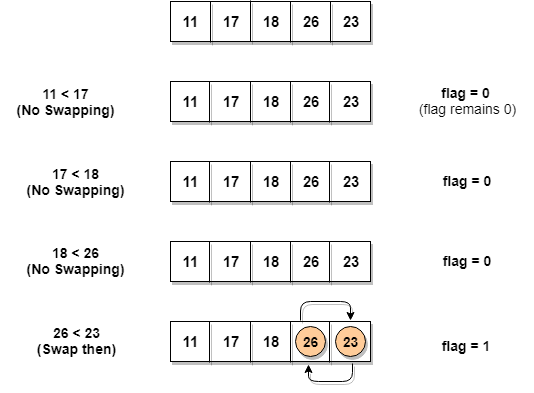

- [Bubble Sort](#bubble-sort)
  - [Strategy](#strategy)
  - [Complexity Analysis](#complexity-analysis)
  - [Verdict](#verdict)
  - [Few More Donut](#few-more-donut)
  - [:bulb: Challenges](#bulb-challenges)
  - [Links](#links)
- [Selection Sort](#selection-sort)
  - [Strategy](#strategy-1)
  - [Complexity Analysis](#complexity-analysis-1)
  - [Verdict](#verdict-1)
  - [Few More Donut](#few-more-donut-1)
  - [:bulb: Challenges](#bulb-challenges-1)
  - [Links](#links-1)

# Bubble Sort

**Bubble Sort** is a simple algorithm which is used to sort a given set of n elements provided in form of an array with n number of elements. Bubble Sort compares all the element one by one and sort them based on their values.

If the given array has to be sorted in ascending order, then bubble sort will start by comparing the first element of the array with the second element, if the first element is greater than the second element, it will swap both the elements, and then move on to compare the second and the third element, and so on.

If we have total n elements, then we need to repeat this process for n-1 times.

**It is known as bubble sort, because with every complete iteration the largest element in the given array, bubbles up towards the last place or the highest index, just like a water bubble rises up to the water surface.**

Sorting takes place by stepping through all the elements one-by-one and comparing it with the adjacent element and swapping them if required.

## Strategy

1. Starting with the first element(index = 0), compare the current element with the next element of the array.
2. If the current element is greater than the next element of the array, swap them.
3. If the current element is less than the next element, move to the next element. Repeat Step 1.

Let's consider an array with values `{5, 1, 6, 2, 4, 3}`

Below, we have a pictorial representation of how bubble sort will sort the given array.

<p align="center">
  
</p>

So as we can see in the representation above, after the first iteration, `6` is placed at the last index, which is the correct position for it.

Similarly after the second iteration, `5` will be at the second last index, and so on.

```
function BubbleSort(a){
    for (var i=0;i<a.length;i++){
        for(var j=i+1;j<a.length;j++){
            if(a[j]<a[i]){
               a[i]=a[i]*a[j];
               a[j]=a[i]/a[j];
               a[i]=a[i]/a[j];
            }
            console.log(a)

        }
    }
}
a=[5, 1, 6, 2, 4, 3]


console.log("Before Sorting",a);
BubbleSort(a)
console.log("After Sorting",a);

```

**OUTPUT**

```

Sort_Bubble:11 Before Sorting (6) [5, 1, 6, 2, 4, 3]
Sort_Bubble:11 (6) [1, 5, 6, 2, 4, 3]
Sort_Bubble:11 (6) [1, 5, 6, 2, 4, 3]
Sort_Bubble:11 (6) [1, 5, 6, 2, 4, 3]
Sort_Bubble:11 (6) [1, 5, 6, 2, 4, 3]
Sort_Bubble:11 (6) [1, 5, 6, 2, 4, 3]
Sort_Bubble:11 (6) [1, 5, 6, 2, 4, 3]
Sort_Bubble:11 (6) [1, 2, 6, 5, 4, 3]
Sort_Bubble:11 (6) [1, 2, 6, 5, 4, 3]
Sort_Bubble:11 (6) [1, 2, 6, 5, 4, 3]
Sort_Bubble:11 (6) [1, 2, 5, 6, 4, 3]
Sort_Bubble:11 (6) [1, 2, 4, 6, 5, 3]
Sort_Bubble:11 (6) [1, 2, 3, 6, 5, 4]
Sort_Bubble:11 (6) [1, 2, 3, 5, 6, 4]
Sort_Bubble:11 (6) [1, 2, 3, 4, 6, 5]
Sort_Bubble:11 (6) [1, 2, 3, 4, 5, 6]
Sort_Bubble:22 After Sorting (6) [1, 2, 3, 4, 5, 6]


```

**Although the above logic will sort an unsorted array, still the above algorithm is not efficient because as per the above logic, the outer for loop will keep on executing for 6 iterations even if the array gets sorted after the second iteration.**

<h2>Optimized Bubble Sort Algorithm</h2>

To optimize our bubble sort algorithm, we can introduce a `flag` to monitor whether elements are getting swapped inside the inner `for` loop.

Hence, in the inner `for` loop, we check whether swapping of elements is taking place or not, everytime.

If for a particular iteration, no swapping took place, it means the array has been sorted and we can jump out of the `for` loop, instead of executing all the iterations.

Let's consider an array with values `{11, 17, 18, 26, 23}`

Below, we have a pictorial representation of how the optimized bubble sort will sort the given array.

<p align="center">
  
</p>

```


function BubbleSort(a){
    for (var i=0;i<a.length;i++){
        for(var j=i+1;j<a.length;j++){

            var flag=0;
            if(a[j]<a[i]){
               a[i]=a[i]*a[j];
               a[j]=a[i]/a[j];
               a[i]=a[i]/a[j];
                flag=1;
            }

            console.log("Current : ",a);
            if(flag==1){
                console.log("Flagged Now");
                break;
            }
            console.log("NOT Flagged");

        }
    }
}
a=[5, 1, 6, 2, 4, 3]


console.log("Before Sorting",a);
BubbleSort(a)
console.log("After Sorting",a);

```

**OUTPUT**

```
Sort_Bubble:   Before Sorting (6) [5, 1, 6, 2, 4, 3]
Sort_Bubble:14 Current :  (6) [1, 5, 6, 2, 4, 3]
Sort_Bubble:16 Flagged Now
Sort_Bubble:14 Current :  (6) [1, 5, 6, 2, 4, 3]
Sort_Bubble:19 NOT Flagged
Sort_Bubble:14 Current :  (6) [1, 2, 6, 5, 4, 3]
Sort_Bubble:16 Flagged Now
Sort_Bubble:14 Current :  (6) [1, 2, 5, 6, 4, 3]
Sort_Bubble:16 Flagged Now
Sort_Bubble:14 Current :  (6) [1, 2, 5, 4, 6, 3]
Sort_Bubble:16 Flagged Now
Sort_Bubble:14 Current :  (6) [1, 2, 5, 4, 3, 6]
Sort_Bubble:16 Flagged Now
Sort_Bubble:29 After Sorting (6) [1, 2, 5, 4, 3, 6]
```

## Complexity Analysis

In Bubble Sort, n-1 comparisons will be done in the 1st pass, n-2 in 2nd pass, n-3 in 3rd pass and so on. So the total number of comparisons will be,

```
(n-1) + (n-2) + (n-3) + ..... + 3 + 2 + 1
Sum = n(n-1)/2
i.e O(n2)
```

Hence the time complexity of Bubble Sort is O(n2).

The main advantage of Bubble Sort is the simplicity of the algorithm.

The space complexity for Bubble Sort is O(1), because only a single additional memory space is required i.e. for temp variable.

Also, the best case time complexity will be O(n), it is when the list is already sorted.

Following are the Time and Space complexity for the Bubble Sort algorithm.

## Verdict

- Worst Case Time Complexity [ Big-O ]: **O(N<sup>2</sup>)**
- Best Case Time Complexity [Big-omega]: **O(N)**
- Average Time Complexity [Big-theta]: **O(N<sup>2</sup>)**
- Space Complexity: O(1)

## Few More Donut

## :bulb: Challenges

## Links

- https://www.studytonight.com/data-structures/bubble-sort


# Selection Sort

## Strategy

1. Choose the largest/smallest item in the array and place the item in its correct place
2. Choose the next larges/next smallest item in the array and place the item in its correct place.
3. Repeat the process until all items are sorted

<p align="center">
  
</p>

Selection sort is a simple sorting algorithm. This sorting algorithm is an [`in-place comparison-based`](/PlayGround/Playground.md#swap-in-place-numbers) algorithm in which the list is divided into two parts, the sorted part at the left end and the unsorted part at the right end. Initially, the sorted part is empty and the unsorted part is the entire list.

1. The Left End which is already sorted.
2. The Right End which is unsorted.

The smallest element is selected from the unsorted array and swapped with the leftmost element, and that element becomes a part of the sorted array. This process continues moving unsorted array boundary by one element to the right.

`In real life`, this can be explained by picturing how you would sort a deck of cards. Using a shuffled deck, you can go through the cards one by one until you find the lowest card. You set this aside as a new, second pile. You then look for the next-lowest card and once found, you put it at the bottom of the second pile. You repeat this until the first pile is empty.

In every iteration of selection sort, the minimum element (considering ascending order) from the unsorted End is picked and moved to the sorted End.

This algorithm is not suitable for large data sets as its average and worst case complexities are of **O(N<sup>2</sup>)**., where n is the number of items.

<p align="center">
  
</p>

```


import java.util.*;

class SelectionSort {
    void sort(int a[]) {

        int length = a.length;
        int min_index;

        for (int i = 0; i < length - 1; i++) {
            min_index = i;
            for (int j = i + 1; j < length; j++) {
                if (a[j] < a[min_index]) {
                    min_index = j;
                }
            }
            if (i != min_index) {
                a[i] = a[i] + a[min_index];
                a[min_index] = a[i] - a[min_index];
                a[i] = a[i] - a[min_index];
            }
        }
        System.out.println("Sorted Number : ");
        print(a);
        // for (int i = 0; i < a.length; i++) {
        // System.out.print(a[i]);
        // }
        System.out.println("\n\n");
    }

    void sort(String a[]) {

        int length = a.length;
        int min_index;

        for (int i = 0; i < length - 1; i++) {
            min_index = i;
            for (int j = i + 1; j < length; j++) {
                if (a[min_index].compareTo(a[j]) > 0) {
                    min_index = j;
                }
            }
            // Swap Strings
            if (i != min_index) {
                a[i] = a[i] + a[min_index];
                a[min_index] = a[i].substring(0, a[i].length() - a[min_index].length());
                a[i] = a[i].substring(a[min_index].length());
            }
        }
        System.out.println("Sorted Strings :\n");
        print(a);

    }

    void print(int a[]) {
        for (int i = 0; i < a.length; i++) {
            System.out.println(a[i]);
        }
    }

    void print(String a[]) {
        for (int i = 0; i < a.length; i++) {
            System.out.println(a[i]);
        }
    }

    void reverse(int a[]) {
        int i, t, n = a.length;

        for (i = 0; i < n / 2; i++) {
            t = a[i];
            a[i] = a[n - i - 1];
            a[n - i - 1] = t;
        }
        System.out.println("\nReverese String print:\n");
        print(a);
    }

    public static void main(String args[]) {
        SelectionSort s = new SelectionSort();
        int b[] = { 2, 3, 1, 4, 9, 5, 6, 7 };
        String name[] = { "Charan", "Advaitha", "Varun", "AAdvaitha", "Bablu", "David" };
        s.sort(b);
        s.sort(name);

        // USing Array Library directly to sort
        Arrays.sort(b);
        s.reverse(b);
    }
}
```

**OutPut :**

```
Sorted Number :
1
2
3
4
5
6
7
9


Sorted Strings :

AAdvaitha
Advaitha
Bablu
Charan
David
Varun

Reverese String print:

9
7
6
5
4
3
2
1
```

## Complexity Analysis

For an array with size n, the external loop will iterate from n‐1 to 1.

```
          for(int i=0;i<arr.length;i++)
```

For each iteration, to find the largest number in subarray, the number of comparison inside the internal loop must is equal to the value of last.

```
        for(int j=i+1;j<arr.length;j++){
```

Therefore the total comparison for Selection Sort in each iteration is (n‐1) + (n‐2) + ….. 2 + 1.

i.e To find the minimum element from the array of `N` elements, `N-1` comparisons are required. After putting the minimum element in its proper position, the size of an unsorted array reduces to `N-1` and then `N-2` comparisons are required to find the minimum in the unsorted array.

Therefore `(N-1)` + `(N-2)` + . . . + `1` = `(N.(N-1)/2)` comparisons and `N` swaps result in the overall complexity of **O(N<sup>2</sup>)**.

> **Average Case**

<p align="center">
  
</p>

> **Worst Case**

<p align="center">
  
</p>

## Verdict

- The efficiency of Selection Sort does not depend on the initial arrangement of the data.
- Only appropriate for small n ‐ **O(N<sup>2</sup>)** algorithm
- Time Complexity for Selection Sort is the same for all cases ‐ worse case, best case or average - case O(n<sup>2</sup>).

| Selection    | Comparison           | Swap |
| ------------ | -------------------- | ---- |
| Best Case    | **O(N<sup>2</sup>)** | O(N) |
| Average Case | **O(N<sup>2</sup>)** | O(N) |
| Worst Case   | **O(N<sup>2</sup>)** | O(N) |

## Few More Donut

- [Stable Selection Sort](https://www.geeksforgeeks.org/stable-selection-sort/) :star:
- [String Sort](../../../PlayGround/ResourcesFiles/ReadMeResources/Interview.md#StringSort)

## :bulb: Challenges

- [ ] [Mobile Numeric Keypad Problem](https://www.geeksforgeeks.org/mobile-numeric-keypad-problem/) or [Old keypad in a foreign land](https://www.hackerearth.com/practice/algorithms/sorting/selection-sort/practice-problems/algorithm/old-keypad-in-a-foreign-land-24/)

- [ ] https://practice.geeksforgeeks.org/problems/selection-sort/1

## Links

- **Reference** :

  - https://www.geeksforgeeks.org/selection-sort/
  - https://www.geeksforgeeks.org/external-sorting/

- **Visualizer** - https://www.hackerearth.com/practice/algorithms/sorting/selection-sort/visualize/


