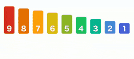
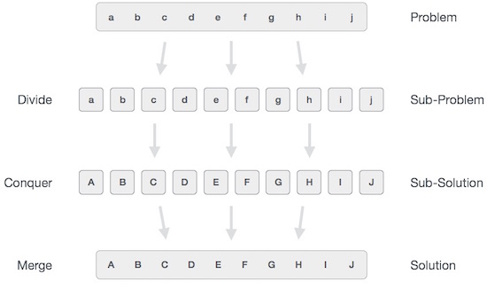

- [Bubble Sort](#bubble-sort)
  - [Strategy](#strategy)
  - [Complexity Analysis](#complexity-analysis)
  - [Verdict](#verdict)
  - [Few More Donut](#few-more-donut)
  - [:bulb: Challenges](#bulb-challenges)
  - [Links](#links)
- [Selection Sort](#selection-sort)
  - [Strategy](#strategy-1)
  - [Complexity Analysis](#complexity-analysis-1)
  - [Verdict](#verdict-1)
  - [Few More Donut](#few-more-donut-1)
  - [:bulb: Challenges](#bulb-challenges-1)
  - [Links](#links-1)
- [Insertion Sort](#insertion-sort)
  - [Strategy](#strategy-2)
  - [Complexity Analysis](#complexity-analysis-2)
  - [Verdict](#verdict-2)
  - [Few More Donut](#few-more-donut-2)
  - [:bulb: Challenges](#bulb-challenges-2)
  - [Links](#links-2)
- [Bubble Vs Selection Vs Insertion Sorting](#bubble-vs-selection-vs-insertion-sorting)
- [Divide and Conquer Algorithms](#divide-and-conquer-algorithms)
  - [Divide/Break](#dividebreak)
  - [Conquer/Solve](#conquersolve)
  - [Merge/Combine](#mergecombine)
  - [Fundamental of Divide & Conquer Strategy:](#fundamental-of-divide--conquer-strategy)
- [Merge Sort](#merge-sort)
  - [Strategy](#strategy-3)
  - [Complexity Analysis](#complexity-analysis-3)
  - [Verdict](#verdict-3)
  - [Few More Donut](#few-more-donut-3)
  - [:bulb: Challenges](#bulb-challenges-3)
  - [Links](#links-3)

# Bubble Sort

**Bubble Sort** is a simple algorithm which is used to sort a given set of n elements provided in form of an array with n number of elements. Bubble Sort compares all the element one by one and sort them based on their values.

If the given array has to be sorted in ascending order, then bubble sort will start by comparing the first element of the array with the second element, if the first element is greater than the second element, it will swap both the elements, and then move on to compare the second and the third element, and so on.

If we have total n elements, then we need to repeat this process for n-1 times.

**It is known as bubble sort, because with every complete iteration the largest element in the given array, bubbles up towards the last place or the highest index, just like a water bubble rises up to the water surface.**

Sorting takes place by stepping through all the elements one-by-one and comparing it with the adjacent element and swapping them if required.

## Strategy

1. Starting with the first element(index = 0), compare the current element with the next element of the array.
2. If the current element is greater than the next element of the array, swap them.
3. If the current element is less than the next element, move to the next element. Repeat Step 1.

Let's consider an array with values `{5, 1, 6, 2, 4, 3}`

Below, we have a pictorial representation of how bubble sort will sort the given array.

<p align="center">
  
</p>

So as we can see in the representation above, after the first iteration, `6` is placed at the last index, which is the correct position for it.

Similarly after the second iteration, `5` will be at the second last index, and so on.

<h2>Bubble Sort 1</h2>

```
// ###############################################################################
//  -------->>>>>> 1. Basic Bubble sort
//  -------->>>>>> Notice : Irrespective it always loops for array.length times each time
// Before Sorting [ 5, 1, 6, 2, 4, 3 ]
// [ 5, 1, 6, 2, 4, 3 ] 5 1
// [ 1, 5, 6, 2, 4, 3 ] 5 6
// [ 1, 5, 6, 2, 4, 3 ] 6 2
// [ 1, 5, 2, 6, 4, 3 ] 6 4
// [ 1, 5, 2, 4, 6, 3 ] 6 3

// --- + One More FOR Loop Done
// [ 1, 5, 2, 4, 3, 6 ] 1 5
// [ 1, 5, 2, 4, 3, 6 ] 5 2
// [ 1, 2, 5, 4, 3, 6 ] 5 4
// [ 1, 2, 4, 5, 3, 6 ] 5 3
// [ 1, 2, 4, 3, 5, 6 ] 5 6

// --- + One More FOR Loop Done
// [ 1, 2, 4, 3, 5, 6 ] 1 2
// [ 1, 2, 4, 3, 5, 6 ] 2 4
// [ 1, 2, 4, 3, 5, 6 ] 4 3
// [ 1, 2, 3, 4, 5, 6 ] 4 5
// [ 1, 2, 3, 4, 5, 6 ] 5 6

// --- + One More FOR Loop Done   // No Swap But we Still Loop
// [ 1, 2, 3, 4, 5, 6 ] 1 2
// [ 1, 2, 3, 4, 5, 6 ] 2 3
// [ 1, 2, 3, 4, 5, 6 ] 3 4
// [ 1, 2, 3, 4, 5, 6 ] 4 5
// [ 1, 2, 3, 4, 5, 6 ] 5 6

// --- + One More FOR Loop Done   // No Swap But we Still Loop
// [ 1, 2, 3, 4, 5, 6 ] 1 2
// [ 1, 2, 3, 4, 5, 6 ] 2 3
// [ 1, 2, 3, 4, 5, 6 ] 3 4
// [ 1, 2, 3, 4, 5, 6 ] 4 5
// [ 1, 2, 3, 4, 5, 6 ] 5 6

// --- + One More FOR Loop Done
// After Sorting [ 1, 2, 3, 4, 5, 6 ]
// LOOPS : 25

var loop=0;
function BubbleSort(a) {
  for (let i = 0; i < a.length - 1; i++) {
    for (let j = 0; j < a.length - 1; j++) {
      console.log(a, a[j], a[j + 1]); // SOMETIMES Comapring with undefined
      if (a[j] > a[j + 1]) {
        a[j] = a[j] * a[j + 1];
        a[j + 1] = a[j] / a[j + 1];
        a[j] = a[j] / a[j + 1];
      }
    }
    console.log("\n--- + One More FOR Loop Done ");
  }
}

a = [5, 1, 6, 2, 4, 3];

console.log("Before Sorting", a);
BubbleSort(a);
console.log("After Sorting", a);
console.log("LOOPS :",loop)
```

**Problem** In Above Bubble Sort We Always loop for array length, which is not needed and fixed in below Bubble sort

<h2>Bubble Sort 2</h2>

```

// ###############################################################################
//  -------->>>>>> 2.  Bubble sort with no 'undefined comparisions'
//  -------->>>>>> Notice :  We Dont Do unwanted inner for loop as already Biggest number bubbled and we descreas the comparision
// Before Sorting [ 5, 1, 6, 2, 4, 3 ]
// [ 5, 1, 6, 2, 4, 3 ] 5 1
// [ 1, 5, 6, 2, 4, 3 ] 5 6
// [ 1, 5, 6, 2, 4, 3 ] 6 2
// [ 1, 5, 2, 6, 4, 3 ] 6 4
// [ 1, 5, 2, 4, 6, 3 ] 6 3

// --- + One More FOR Loop Done
// [ 1, 5, 2, 4, 3, 6 ] 1 5
// [ 1, 5, 2, 4, 3, 6 ] 5 2
// [ 1, 2, 5, 4, 3, 6 ] 5 4
// [ 1, 2, 4, 5, 3, 6 ] 5 3

// --- + One More FOR Loop Done
// [ 1, 2, 4, 3, 5, 6 ] 1 2
// [ 1, 2, 4, 3, 5, 6 ] 2 4
// [ 1, 2, 4, 3, 5, 6 ] 4 3

// --- + One More FOR Loop Done
// [ 1, 2, 3, 4, 5, 6 ] 1 2
// [ 1, 2, 3, 4, 5, 6 ] 2 3

// --- + One More FOR Loop Done
// [ 1, 2, 3, 4, 5, 6 ] 1 2

// --- + One More FOR Loop Done

// --- + One More FOR Loop Done
// After Sorting [ 1, 2, 3, 4, 5, 6 ]
// LOOPS : 15

var loop=0
function BubbleSort2(a) {
  for (let i = a.length; i > 0; i--) {
    for (let j = 0; j < i - 1; j++) {
      console.log(a, a[j], a[j + 1]);
      if (a[j] > a[j + 1]) {
        a[j] = a[j] * a[j + 1];
        a[j + 1] = a[j] / a[j + 1];
        a[j] = a[j] / a[j + 1];
      }
    }
    console.log("\n--- + One More FOR Loop Done ");
  }
}

a = [5, 1, 6, 2, 4, 3];

console.log("Before Sorting", a);
BubbleSort2(a);
console.log("After Sorting", a);
console.log("LOOPS :",loop)
```

<h2>Optimized Bubble Sort Algorithm</h2>

**Problem** When an array is nearly sorted or already sorted, Bubble Sort will again try to sort and does all the loop so there has to be some optimization if array is already sorted .

To optimize our bubble sort algorithm, we can introduce a `flag` to monitor whether elements are getting swapped inside the inner `for` loop.

Hence, in the inner `for` loop, we check whether swapping of elements is taking place or not, everytime.

If for a particular iteration, no swapping took place, it means the array has been sorted and we can jump out of the `for` loop, instead of executing all the iterations.

Example : if a=[1,2,3,4,5] , Bubble sort will have below looping

```

Before Sorting [ 1, 2, 3, 4, 5, 6 ]
[ 1, 2, 3, 4, 5, 6 ] 1 2
[ 1, 2, 3, 4, 5, 6 ] 2 3
[ 1, 2, 3, 4, 5, 6 ] 3 4
[ 1, 2, 3, 4, 5, 6 ] 4 5
[ 1, 2, 3, 4, 5, 6 ] 5 6

--- + One More FOR Loop Done
[ 1, 2, 3, 4, 5, 6 ] 1 2
[ 1, 2, 3, 4, 5, 6 ] 2 3
[ 1, 2, 3, 4, 5, 6 ] 3 4
[ 1, 2, 3, 4, 5, 6 ] 4 5

--- + One More FOR Loop Done
[ 1, 2, 3, 4, 5, 6 ] 1 2
[ 1, 2, 3, 4, 5, 6 ] 2 3
[ 1, 2, 3, 4, 5, 6 ] 3 4

--- + One More FOR Loop Done
[ 1, 2, 3, 4, 5, 6 ] 1 2
[ 1, 2, 3, 4, 5, 6 ] 2 3

--- + One More FOR Loop Done
[ 1, 2, 3, 4, 5, 6 ] 1 2

--- + One More FOR Loop Done

--- + One More FOR Loop Done
After Sorting [ 1, 2, 3, 4, 5, 6 ]

```

**Solution** :

if in inner-loop if no swap happens then it means the array is already sorted, there by the upcoming loops wont swap. so lets break the function by checking a introducing a flag.

```

// ###############################################################################
//  -------->>>>>> 3.  Bubble sort with OPTIMIZATION i.e with FLag
//  -------->>>>>> Notice :  We Dont Do unwanted inner for loop as already the array is sorted

function BubbleSort3(a) {
  for (let i = a.length; i > 0; i--) {
    swap = false;
    for (let j = 0; j < i - 1; j++) {
      console.log(a, a[j], a[j + 1]);
      if (a[j] > a[j + 1]) {
        [a[j], a[j + 1]] = [a[j + 1], a[j]];
        swap = true;
      } // SWAP ARRAY ELEMENTS
    }

    if (!swap) {
      console.log("Array Already Sorted So No More Loops");
      break;
    }
    console.log("\n--- + One PASS Done ");
  }
}

// a = [5, 1, 6, 2, 4, 3];

a = [2, 1, 3, 4, 5, 6];

console.log("Before Sorting", a);
BubbleSort3(a);
console.log("After Sorting", a);

```

**Although the above logic will sort an unsorted array, still the above algorithm is not efficient because as per the above logic, the outer for loop will keep on executing for 6 iterations even if the array gets sorted after the second iteration.**

<div style="text-align: center"><table><tr>
     <td align="center"><a><br /><b>Non - Optmised</b></td>
          <td align="center"><a><br /><b>Optmised</b></td>

</tr></table></div>

## Complexity Analysis

In Bubble Sort, n-1 comparisons will be done in the 1st pass, n-2 in 2nd pass, n-3 in 3rd pass and so on. So the total number of comparisons will be,

> (n-1) + (n-2) + (n-3) + ..... + 3 + 2 + 1
> Sum = n(n-1)/2
> i.e **O(N<sup>2</sup>)**

Hence the time complexity of Bubble Sort is **O(N<sup>2</sup>)**.

The main advantage of Bubble Sort is the simplicity of the algorithm.

The space complexity for Bubble Sort is O(1), because only a single additional memory space is required i.e. for temp variable.

Also, the best case time complexity will be O(n), it is when the list is already sorted.

Following are the Time and Space complexity for the Bubble Sort algorithm.

## Verdict

- Worst Case Time Complexity [ Big-O ]: **O(N<sup>2</sup>)**
- Best Case Time Complexity [Big-omega]: **O(N)**
- Average Time Complexity [Big-theta]: **O(N<sup>2</sup>)**
- Space Complexity: O(1)

## Few More Donut

- [recursive-bubble-sort](https://www.geeksforgeeks.org/recursive-bubble-sort/)

## :bulb: Challenges
- [ ] [hackerearth
 ](https://www.hackerearth.com/practice/algorithms/sorting/bubble-sort/practice-problems/)


## Links

- https://www.studytonight.com/data-structures/bubble-sort


# Selection Sort

## Strategy

1. Choose the largest/smallest item in the array and place the item in its correct place
2. Choose the next larges/next smallest item in the array and place the item in its correct place.
3. Repeat the process until all items are sorted

<p align="center">
  
</p>

Selection sort is a simple sorting algorithm. This sorting algorithm is an [`in-place comparison-based`](/PlayGround/Playground.md#swap-in-place-numbers) algorithm in which the list is divided into two parts, the sorted part at the left end and the unsorted part at the right end. Initially, the sorted part is empty and the unsorted part is the entire list.

1. The Left End which is already sorted.
2. The Right End which is unsorted.

The smallest element is selected from the unsorted array and swapped with the leftmost element, and that element becomes a part of the sorted array. This process continues moving unsorted array boundary by one element to the right.

`In real life`, this can be explained by picturing how you would sort a deck of cards. Using a shuffled deck, you can go through the cards one by one until you find the lowest card. You set this aside as a new, second pile. You then look for the next-lowest card and once found, you put it at the bottom of the second pile. You repeat this until the first pile is empty.

In every iteration of selection sort, the minimum element (considering ascending order) from the unsorted End is picked and moved to the sorted End.

This algorithm is not suitable for large data sets as its average and worst case complexities are of **O(N<sup>2</sup>)**., where n is the number of items.

<p align="center">
  
</p>

```


import java.util.*;

class SelectionSort {
    void sort(int a[]) {

        int length = a.length;
        int min_index;

        for (int i = 0; i < length - 1; i++) {
            min_index = i;
            for (int j = i + 1; j < length; j++) {
                if (a[j] < a[min_index]) {
                    min_index = j;
                }
            }
            if (i != min_index) {
                a[i] = a[i] + a[min_index];
                a[min_index] = a[i] - a[min_index];
                a[i] = a[i] - a[min_index];
            }
        }
        System.out.println("Sorted Number : ");
        print(a);
        // for (int i = 0; i < a.length; i++) {
        // System.out.print(a[i]);
        // }
        System.out.println("\n\n");
    }

    void sort(String a[]) {

        int length = a.length;
        int min_index;

        for (int i = 0; i < length - 1; i++) {
            min_index = i;
            for (int j = i + 1; j < length; j++) {
                if (a[min_index].compareTo(a[j]) > 0) {
                    min_index = j;
                }
            }
            // Swap Strings
            if (i != min_index) {
                a[i] = a[i] + a[min_index];
                a[min_index] = a[i].substring(0, a[i].length() - a[min_index].length());
                a[i] = a[i].substring(a[min_index].length());
            }
        }
        System.out.println("Sorted Strings :\n");
        print(a);

    }

    void print(int a[]) {
        for (int i = 0; i < a.length; i++) {
            System.out.println(a[i]);
        }
    }

    void print(String a[]) {
        for (int i = 0; i < a.length; i++) {
            System.out.println(a[i]);
        }
    }

    void reverse(int a[]) {
        int i, t, n = a.length;

        for (i = 0; i < n / 2; i++) {
            t = a[i];
            a[i] = a[n - i - 1];
            a[n - i - 1] = t;
        }
        System.out.println("\nReverese String print:\n");
        print(a);
    }

    public static void main(String args[]) {
        SelectionSort s = new SelectionSort();
        int b[] = { 2, 3, 1, 4, 9, 5, 6, 7 };
        String name[] = { "Charan", "Advaitha", "Varun", "AAdvaitha", "Bablu", "David" };
        s.sort(b);
        s.sort(name);

        // USing Array Library directly to sort
        Arrays.sort(b);
        s.reverse(b);
    }
}
```

**OutPut :**

```
Sorted Number :
1
2
3
4
5
6
7
9


Sorted Strings :

AAdvaitha
Advaitha
Bablu
Charan
David
Varun

Reverese String print:

9
7
6
5
4
3
2
1
```

## Complexity Analysis

For an array with size n, the external loop will iterate from n‐1 to 1.

```
          for(int i=0;i<arr.length;i++)
```

For each iteration, to find the largest number in subarray, the number of comparison inside the internal loop must is equal to the value of last.

```
        for(int j=i+1;j<arr.length;j++){
```

Therefore the total comparison for Selection Sort in each iteration is (n‐1) + (n‐2) + ….. 2 + 1.

i.e To find the minimum element from the array of `N` elements, `N-1` comparisons are required. After putting the minimum element in its proper position, the size of an unsorted array reduces to `N-1` and then `N-2` comparisons are required to find the minimum in the unsorted array.

Therefore `(N-1)` + `(N-2)` + . . . + `1` = `(N.(N-1)/2)` comparisons and `N` swaps result in the overall complexity of **O(N<sup>2</sup>)**.

> **Average Case**

<p align="center">
  
</p>

> **Worst Case**

<p align="center">
  
</p>

## Verdict

- The efficiency of Selection Sort does not depend on the initial arrangement of the data.
- Only appropriate for small n ‐ **O(N<sup>2</sup>)** algorithm
- Time Complexity for Selection Sort is the same for all cases ‐ worse case, best case or average - case O(n<sup>2</sup>).

| Selection    | Comparison           | Swap |
| ------------ | -------------------- | ---- |
| Best Case    | **O(N<sup>2</sup>)** | O(N) |
| Average Case | **O(N<sup>2</sup>)** | O(N) |
| Worst Case   | **O(N<sup>2</sup>)** | O(N) |

## Few More Donut

- [Stable Selection Sort](https://www.geeksforgeeks.org/stable-selection-sort/) :star:
- [String Sort](../../../PlayGround/ResourcesFiles/ReadMeResources/Interview.md#StringSort)

## :bulb: Challenges

- [ ] [Mobile Numeric Keypad Problem](https://www.geeksforgeeks.org/mobile-numeric-keypad-problem/) or [Old keypad in a foreign land](https://www.hackerearth.com/practice/algorithms/sorting/selection-sort/practice-problems/algorithm/old-keypad-in-a-foreign-land-24/)

- [ ] https://practice.geeksforgeeks.org/problems/selection-sort/1

## Links

- **Reference** :

  - https://www.geeksforgeeks.org/selection-sort/
  - https://www.geeksforgeeks.org/external-sorting/

- **Visualizer** - https://www.hackerearth.com/practice/algorithms/sorting/selection-sort/visualize/


# Insertion Sort

Consider you have 10 cards out of a deck of cards in your hand. And they are sorted, or arranged in the ascending order of their numbers.

If I give you another card, and ask you to insert the card in just the right position, so that the cards in your hand are still sorted. What will you do?

Well, you will have to go through each card from the starting or the back and find the right position for the new card, comparing it's value with each card. Once you find the right position, you will insert the card there.

Similarly, if more new cards are provided to you, you can easily repeat the same process and insert the new cards and keep the cards sorted too.

This is exactly how **insertion sort** works. It starts from the index 1(not 0), and each index starting from index 1 is like a new card, that you have to place at the right position in the sorted subarray on the left.

Following are some of the important characteristics of Insertion Sort:

- It is efficient for smaller data sets, but very inefficient for larger lists.
- Insertion Sort is adaptive, that means it reduces its total number of steps if a partially sorted array is provided as input, making it efficient.
- It is better than Selection Sort and Bubble Sort algorithms.
- Its space complexity is less. Like bubble Sort, insertion sort also requires a single additional memory space.
- It is a stable sorting technique, as it does not change the relative order of elements which are equal.

## Strategy

Following are the steps involved in insertion sort:

- We start by making the second element of the given array, i.e. element at index 1, the key. The key element here is the new card that we need to add to our existing sorted set of cards(remember the example with cards above).
- We compare the key element with the element(s) before it, in this case, element at index 0:
- If the key element is less than the first element, we insert the key element before the first element.
- If the key element is greater than the first element, then we insert it after the first element.
- Then, we make the third element of the array as key and will compare it with elements to it's left and insert it at the right position.
- And we go on repeating this, until the array is sorted.

Let's consider an array with values {5, 1, 6, 2, 4, 3}

 <p align="center">
  
</p>

As you can see in the diagram above, after picking a `key`, we start iterating over the elements to the left of the `key`.

We continue to move towards left if the elements are greater than the `key` element and stop when we find the element which is less than the `key` element.

And, insert the `key` element after the element which is less than the `key` element.

```

// // ###############################################################################
// //  -------->>>>>> 1. Insertion sort
// //  -------->>>>>> Notice : Irrespective it always loops for array.length times each time
// // Before Sorting [ 5, 1, 6, 2, 4, 3 ]
// // Key to Insert:1         Array to check : [5]
// // After One Loop Pass : [ 1, 5, 6, 2, 4, 3 ]
// // Key to Insert:6         Array to check : [1,5]
// // After One Loop Pass : [ 1, 5, 6, 2, 4, 3 ]
// // Key to Insert:2         Array to check : [1,5,6]
// // After One Loop Pass : [ 1, 2, 5, 6, 4, 3 ]
// // Key to Insert:4         Array to check : [1,2,5,6]
// // After One Loop Pass : [ 1, 2, 4, 5, 6, 3 ]
// // Key to Insert:3         Array to check : [1,2,4,5,6]
// // After One Loop Pass : [ 1, 2, 3, 4, 5, 6 ]
// // After Sorting [ 1, 2, 3, 4, 5, 6 ]
// // Total LOOPs: 8

var loops = 0;
function InsertionSort(a) {
  for (let i = 1; i < a.length; i++) {
    var key = a[i];
    let j = i - 1;
    console.log(
      "\nKey to Insert:" +key +"\t\tArray to check : [" +a.slice(0, j + 1) +"]"
    );
    for (j; j >= 0 && a[j] > key; j--) {
      a[j + 1] = a[j];
      loops++;
      //   console.log(a[(0, 0, 2)]);
    }
    a[j + 1] = key;
    console.log("After One Loop Pass :", a);
  }
}

a = [5, 1, 6, 2, 4, 3];

console.log("\nBefore Sorting", a);
InsertionSort(a);
console.log("\nAfter Sorting", a);
console.log("\nTotal LOOPs :", loops);

```

Now let's try to understand the above simple insertion sort algorithm.

We took an array with 6 integers. We took a variable `key`, in which we put each element of the array, during each pass, starting from the second element, that is a[1].

Then using the for loop, we iterate, until j becomes equal to zero or we find an element which is greater than `key`, and then we insert the `key` at that position.

We keep on doing this, until j becomes equal to zero, or we encounter an element which is smaller than the `key`, and then we stop. The current key is now at the right position.

We then make the next element as `key` and then repeat the same process.

In the above array, first we pick 1 as `key`, we compare it with 5(element before 1), 1 is smaller than 5, we insert 1 before 5. Then we pick 6 as `key`, and compare it with 5 and 1, no shifting in position this time. Then 2 becomes the `key` and is compared with 6 and 5, and then 2 is inserted after 1. And this goes on until the complete array gets sorted.

with a=[1,2,3,4,5,6]

```
Before Sorting [ 1, 2, 3, 4, 5, 6 ]

After Sorting [ 1, 2, 3, 4, 5, 6 ]

Total LOOPs : 0
```

## Complexity Analysis

As we mentioned above that insertion sort is an efficient sorting algorithm, as it does not run on preset conditions using for loops, but instead it uses one while loop, which avoids extra steps once the array gets sorted.

Even though insertion sort is efficient, still, if we provide an already sorted array to the insertion sort algorithm, it will still execute the outer for loop, thereby requiring n steps to sort an already sorted array of n elements, which makes its best case time complexity a linear function of n.

## Verdict

- Worst Case Time Complexity [ Big-O ]: **O(N<sup>2</sup>)**

- Best Case Time Complexity [Big-omega]: **O(n)**

- Average Time Complexity [Big-theta]: **O(N<sup>2</sup>)**

- Space Complexity: O(1)

## Few More Donut

- [Recursive-Insertion-Sort](https://www.geeksforgeeks.org/recursive-insertion-sort/?ref=rp)
- [Binary Search](https://www.geeksforgeeks.org/binary-insertion-sort/?ref=rp)

We can use binary search to reduce the number of comparisons in normal insertion sort. Binary Insertion Sort uses binary search to find the proper location to insert the selected item at each iteration.
In normal insertion sort, it takes O(n^2) comparisons(at nth iteration) in worst case. We can reduce it to **O(log n)** by using binary search.

## :bulb: Challenges

## Links


<!-- # Insertion Sort

## Strategy

## Complexity Analysis

## Verdict

## Few More Donut

## :bulb: Challenges

## Links

 -->

# Bubble Vs Selection Vs Insertion Sorting

**TODO**

- https://www.geeksforgeeks.org/comparison-among-bubble-sort-selection-sort-and-insertion-sort/?ref=rp


# Divide and Conquer Algorithms

In divide and conquer approach, the problem in hand, is divided into smaller sub-problems and then each problem is solved independently. When we keep on dividing the subproblems into even smaller sub-problems, we may eventually reach a stage where no more division is possible. Those "atomic" smallest possible sub-problem (fractions) are solved. The solution of all sub-problems is finally merged in order to obtain the solution of an original problem.

<p align="center">
  
</p>

Broadly, we can understand divide-and-conquer approach in a three-step process.

## Divide/Break

This step involves breaking the problem into smaller sub-problems. Sub-problems should represent a part of the original problem. This step generally takes a recursive approach to divide the problem until no sub-problem is further divisible. At this stage, sub-problems become atomic in nature but still represent some part of the actual problem.

## Conquer/Solve

This step receives a lot of smaller sub-problems to be solved. Generally, at this level, the problems are considered `solved` on their own.

## Merge/Combine

When the smaller sub-problems are solved, this stage recursively combines them until they formulate a solution of the original problem. This algorithmic approach works recursively and conquer & merge steps works so close that they appear as one.

**Examples**
The following computer algorithms are based on divide-and-conquer programming approach −

- Merge Sort
- Quick Sort
- Binary Search
- Strassen's Matrix Multiplication
- Closest pair (points)
- Maximum and Minimum Problem
- Binary Search
- Sorting (merge sort, quick sort)
- Tower of Hanoi.
-

## Fundamental of Divide & Conquer Strategy:

There are two fundamental of Divide & Conquer Strategy:

- Relational Formula
- Stopping Condition

**1. Relational Formula:** It is the formula that we generate from the given technique. After generation of Formula we apply D&C Strategy, i.e. we break the problem recursively & solve the broken subproblems.

**2. Stopping Condition:** When we break the problem using Divide & Conquer Strategy, then we need to know that for how much time, we need to apply divide & Conquer. So the condition where the need to stop our recursion steps of D&C is called as Stopping Condition.

```
DAC(a, i, j)
{
    if(small(a, i, j))
      return(Solution(a, i, j))
    else
      m = divide(a, i, j)               // f1(n)
      b = DAC(a, i, mid)                 // T(n/2)
      c = DAC(a, mid+1, j)            // T(n/2)
      d = combine(b, c)                 // f2(n)
   return(d)
}
```

```
This is recurrence relation for above program.
           O(1) if n is small
T(n) =     f1(n) + 2T(n/2) + f2(n)
```

TODO

- https://www.geeksforgeeks.org/divide-and-conquer-algorithm-introduction/


# Merge Sort

## Strategy

## Complexity Analysis

## Verdict

## Few More Donut

## :bulb: Challenges

## Links


