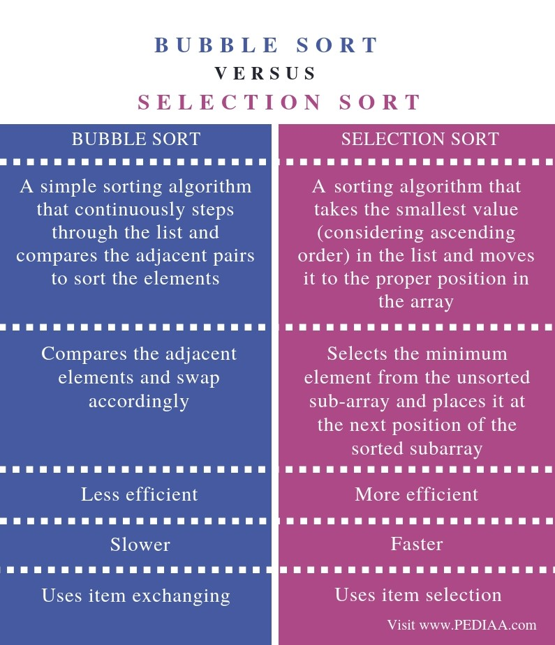
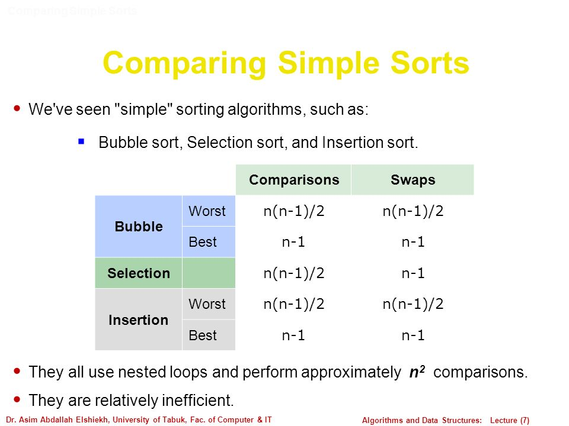

<h1>PAGE UNDER PROGRESSSSSSSSS </h1>

- [Sorting Algorithms](#sorting-algorithms)
- [Conclusion](#conclusion)

<!-- # Topics -->
<h1> Sorting Algorithms </h1>

<h2>  Do i need to learn sorting algorithms even if in-built functions available for sorting ? </h2>
Though Most of the programming Languages support in build Sorting functions on datastructures. Its Still a good idea to understand how the underlying Sorting works.

`Example`
Lets see the javascript function `sort` which is in build function to sort an array.

```
    ['c','a','d','b'].sort()

    ["a", "b", "c", "d"]
```

while above is correct lets see for Integer array

```
    // While this works perfectly as expected
    [3,2,1,9,5].sort()
    [1, 2, 3, 5, 9]

    // This is not working as expected
    [6,4,15,10].sort()
    [10, 15, 4, 6]
```

The Above Disparity in answers is because of javascript `sort` function implementation - [check this](https://developer.mozilla.org/en-US/docs/Web/JavaScript/Reference/Global_Objects/Array/sort)

i.e

> arr.sort([compareFunction])
>
> Specifies a function that defines the sort order. If omitted, the array elements are converted to strings, then sorted according to each character's Unicode code point value.
> if no `compareFunction` provided

Now it works fine as shown below

```
    // Ascending
    function compare(a,b){return a-b}

    [6,4,15,10].sort(compare)
    [4, 6, 10, 15]


    // Descending
    function compare(a,b){return b-a}

    [6,4,15,10].sort(compare)
    [15, 10, 6, 4]

```

<h2>Points to Explore</h2>

- [ ] What is in-place sorting?
- [ ] What are Internal and External Sortings?
  - [External Sorting](https://www.geeksforgeeks.org/external-sorting/)
- [ ] [What is stable sorting?](https://www.geeksforgeeks.org/stability-in-sorting-algorithms/) **<sup>[[1]](https://en.wikipedia.org/wiki/Sorting_algorithm#Stability)</sup><sup>[[2]](http://homepages.math.uic.edu/~leon/cs-mcs401-s08/handouts/stability.pdf)</sup>**
  - Which sorting algorithms are stable?
  - Which sorting algorithms are unstable?
  - Can we make any sorting algorithm stable?

<!--  -->

> ➤➤➤ SWAP
>
> in JS its so simple to Swap two array elements as
>
> Swapping i & j elements of Array a ---> [a[i],a[j]]=[a[j],a[i]]

# Sorting Algorithms

- [x] [Bubble Sort](AllSortingAlgorithms.md#bubble-sort)
- [x] [Selection Sort](AllSortingAlgorithms.md#selection-sort)
- [ ] [Insertion Sort](AllSortingAlgorithms.md#insertion-sort)

<!--
|       |   Topic    | ReadMe | Complexity |
| :---: | :--------: | :----: | :--------: |
|  [ ]  | Algorithms |  link  |    `B`     |
 -->

**<sup>[[1]](https://www.geeksforgeeks.org/fundamentals-of-algorithms/)</sup>** **<sup>[[2]](https://www.includehelp.com/data-structure-tutorial/algorithm-and-its-types.aspx)</sup>**

# Conclusion

|  Sorting  |      Best case       |      Worst case      |     Average case     | Stable |  Method   |
| :-------: | :------------------: | :------------------: | :------------------: | :----: | :-------: |
| Selection | **O(N<sup>2</sup>)** | **O(N<sup>2</sup>)** | **O(N<sup>2</sup>)** |   No   | Selection |
|           |                      |                      |                      |        |
|           |                      |                      |                      |        |

- [15 Sorting Algorithms in 6 Minutes](https://www.youtube.com/watch?v=kPRA0W1kECg&feature=emb_title)

<p align="center">
  
</p>

  <a align="center"> 
    
 </a>

  <a align="center"> 
    
 </a>
