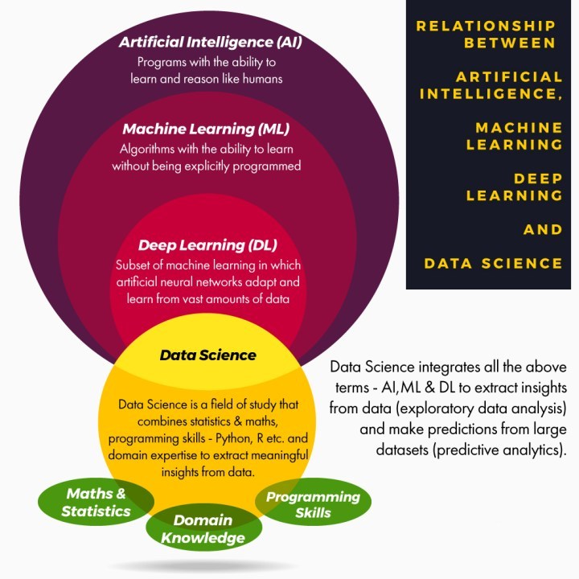

#  🏗️  .....IN PROGRESS 🚧 

Table of Contents
=================

   * [What is Artificial Intelligence?](#what-is-artificial-intelligence)
   * [What is Machine Learning?](#what-is-machine-learning)
   * [What is Deep Learning?](#what-is-deep-learning)
   * [What is Data Science?](#what-is-data-science)
   * [How are all these fields related to each other?](#how-are-all-these-fields-related-to-each-other)
   * [Reference](#reference)

> Data is the new oil for all the industries and data science is the electricity that powers the industry

**I**n today’s world, it has become a necessity to possess `data-literacy`. We must learn how crude data can transform into meaningful products. We must learn the techniques and understand the requirements to analyze and draw insights from the data.

  
  

> “Where there is data smoke, there is a business fire” **- Thomas Redman**.

 

  

 

One of the most common confusions arises among the modern technologies such as `artificial intelligence`, `machine learning`, `big data`, `data science`, `deep learning` and more. While they are all closely interconnected, each has a distinct purpose and functionality. Over the past few years, the popularity of these technologies has risen.

<!-- <dl>
  <dt><b>Definition list</b></dt>
  <dd>Is something people use sometimes.</dd>

  <dt>Markdown in HTML</dt>
  <dd>Does *not* work **very** well. Use HTML <em>tags</em>.</dd>
</dl> -->

# What is Artificial Intelligence?
As we step into a world fascinated by and obsessed with the term “Artificial Intelligence”, it becomes much easier to throw it around. But these are concepts that work together to invent a better, smarter world that is also more productive.

Artificial Intelligence, fondly abbreviated as AI, is concerned with imparting human intelligence to machines. It focuses on the development of intelligent machines that can think and act like humans; essentially, AI is intelligence such as machines display. An intelligent agent is a device that can perceive its environment and act to optimize its chances of success. Such intelligent machines mimic human cognitive functions like learning and problem-solving.

🏁 [YourArtificial Intelligence - Journey Starts here ---->>>>](3.AI/README.md)

# What is Machine Learning?

>The scientific study and analysis through statistical modeling and computing algorithms that allow systems to make autonomous decisions without explicit intervention is called Machine Learning.

There are two main operations in machine learning – classification and regression. Based on these operations, machine learning makes use of predictive models that calculate the likelihood of the occurrence of events. In general, machine learning facilitates computers to learn without explicitly feeding instructions.

**For example**, we provide standardized instructions to the computers for it to execute operations. These instructions can be in a high-level programming language or a low-level machine language. Based on the set of instructions, a computer provides you with the right output. Therefore, there is a constant exchange of inputs and outputs. What if you could train your machine to provide you with the output based on all inputs you provide to it? That’s way, you will not have to undergo a tedious process of feeding it with inputs again and again. This methodology of training your machine on historical data to provide you with the output is called Machine Learning. Data is the life and soul of machine learning algorithms

**Machine Learning often deals with the following issues:**

* Collecting data
* Filtering data
* Analyzing data
* Training algorithms
* Testing algorithms
* Using algorithms for future predictions

🏁 [Your Machine Learning - Journey Starts here ---->>>>](2.MachineLearning/README.md)

# What is Deep Learning?
Deep Learning is an approach to Machine Learning; one that focuses on learning data representations rather than on task-specific algorithms. It makes use of Deep Neural Networks, which are inspired by the structure and function of the human brain.

Likewise, Deep Learning is an approach to ML itself and claims to benefit it. Deep Learning makes use of `Deep Neural Networks`, inspired by the structure and function of the human brain. These networks are made of multiple layers that data must pass through before producing the output. Deep Learning improves AI by enabling many of its practical applications- DL makes it possible.

Such networks are made of a huge number of layers (hence, their name). Data transforms through multiple layers before producing the output.
Deep Learning is used for purposes like Natural Language Processing (NLP), drug discovery and toxicology, bioinformatics, and many more.

> **To put it into perspective, AI was birthed first. Then came in ML, which was an approach to AI. Finally, DL stormed in and made possible all that was still only to be dreamed of at the moment**.

# What is Data Science?

> The rise in the quantity of data has led to the creation of a new discipline called **Data Science**.

Data has become a `necessary fuel for the industries`, bringing about the fourth industries revolution. Data Science has been crowned as the most coveted jobs of this century. All the growth and evolution in the field of computer science has led us to the current field of Data Science.

It is a vast umbrella term that incorporates all the underlying data operations, statistical models as well as mathematical analysis. The supermassive explosion and exponential increase of data have created an opportunity for businesses to capitalize on. Using this data, industries are able to make careful decisions and implement useful business strategies. Data is everywhere around us. Every day, our mobile phones, gadgets, sensors generate quintillion bytes of data. It has become a source of energy that is utilized in every sector of our society.
<!--                        -->

🏁 [Your Data Science - Journey Starts here ---->>>>](DataScience/README.md)

<!--  

  

  -->

# How are all these fields related to each other?

 

  

 

The interdisciplinary field of data science uses key skills of a wide range of fields including machine learning, statistics, visualization etc. It enables us to identify meaning and appropriate information from huge volumes of data to make informed decisions in technology, science, business etc.

For a simpler view on the relation between these technologies, artificial intelligence is applied based on machine learning. And machine learning is a part of data science that draws features from algorithms and statistics to work on the data extracted from and produced by multiple resources. Thus, you can say data science merges together a bunch of algorithms obtained from machine learning to develop a solution, and during the process, lots of ideas from traditional domain expertise, statistics and mathematics are borrowed.

# Reference

- Start here : 
  - :chart_with_upwards_trend: https://dzone.com/articles/data-science-vs-artificial-intelligence-vs-machine
  - https://data-flair.training/blogs/artificial-intelligence-vs-machine-learning-vs-dl-vs-ds/
  - :chart_with_upwards_trend: Python :
    - https://data-flair.training/blogs/python-tutorials-home/
-  Tutorial : 
   -  https://data-flair.training/blogs/data-science-tutorials-home/
   -  https://data-flair.training/blogs/what-is-data-science/

<!--  

  

  -->
