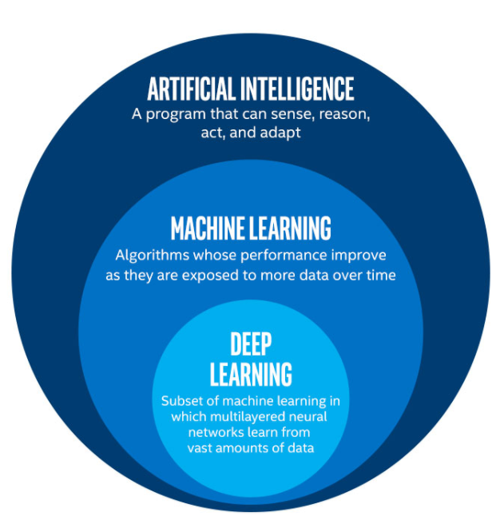
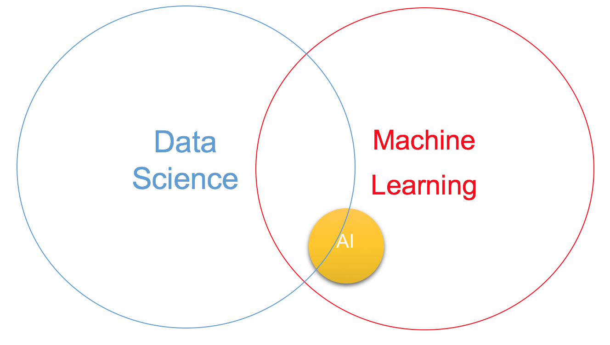
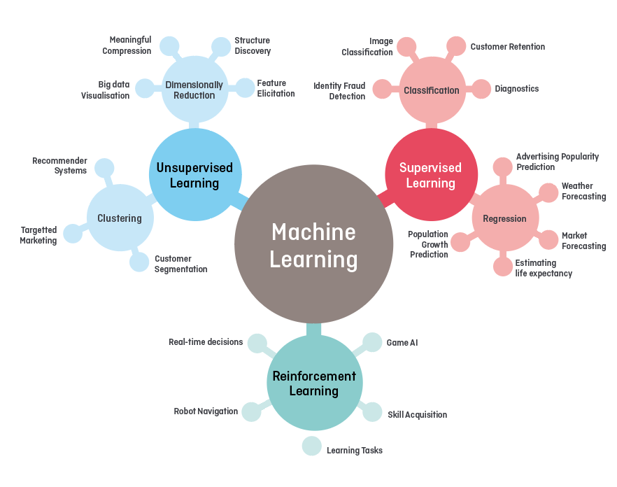

#  🏗️  DataScience .....IN PROGRESS 🚧 

 

  

 

 

  

 

 

  

 

 

  

# Reference

- Start here : 
  - :chart_with_upwards_trend: https://dzone.com/articles/data-science-vs-artificial-intelligence-vs-machine
  - :chart_with_upwards_trend: Python :
    - https://data-flair.training/blogs/python-tutorials-home/
-  Tutorial : 
   -  https://data-flair.training/blogs/data-science-tutorials-home/
   -  https://data-flair.training/blogs/what-is-data-science/

<!--  

  

  -->
