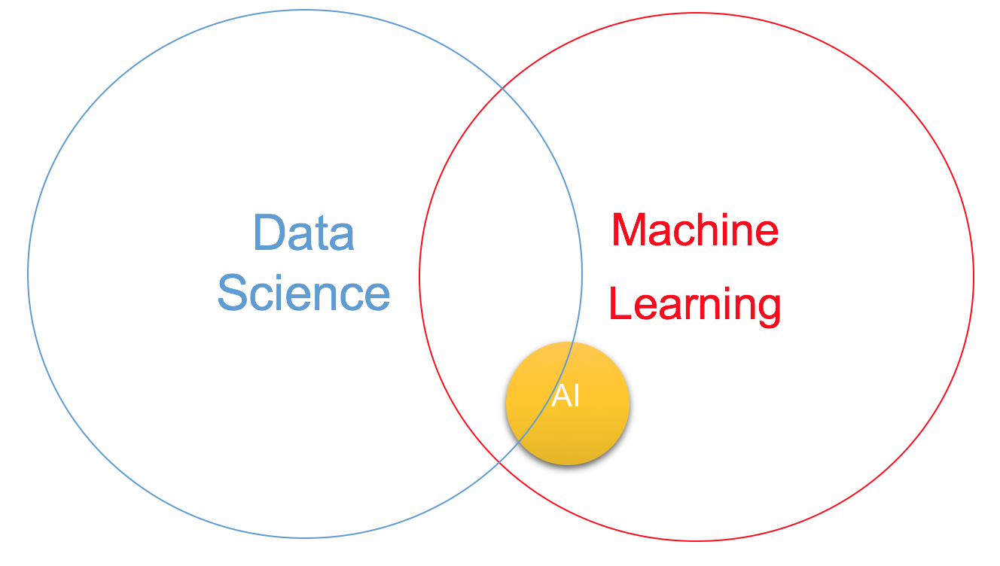
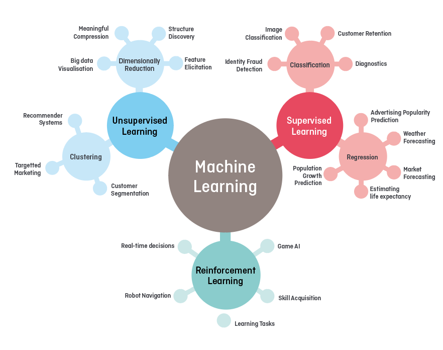

#  🏗️  DataScience .....IN PROGRESS 🚧 

                One of the most common confusions arises among the modern technologies such as artificial intelligence, machine learning, big data, data science, deep learning and more. While they are all closely interconnected, each has a distinct purpose and functionality. Over the past few years, the popularity of these technologies has risen to such an extent that several companies have now woken up to their importance on massive levels and are increasingly looking to implement them for their business growth.

What is Data Science?
                      

 

  

 

 

  

 

 

  

 

 

  

# Reference

- Start here : 
  - :chart_with_upwards_trend: https://dzone.com/articles/data-science-vs-artificial-intelligence-vs-machine
  - :chart_with_upwards_trend: Python :
    - https://data-flair.training/blogs/python-tutorials-home/
-  Tutorial : 
   -  https://data-flair.training/blogs/data-science-tutorials-home/
   -  https://data-flair.training/blogs/what-is-data-science/

<!--  

  

  -->
