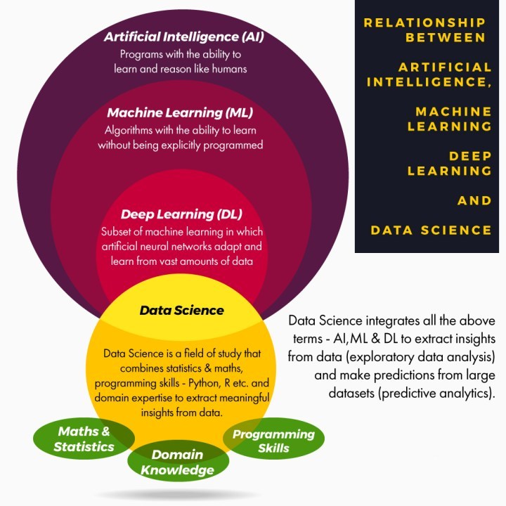

#  🏗️  DataScience .....IN PROGRESS 🚧 

  One of the most common confusions arises among the modern technologies such as artificial intelligence, machine learning, big data, data science, deep learning and more. While they are all closely interconnected, each has a distinct purpose and functionality. Over the past few years, the popularity of these technologies has risen to such an extent that several companies have now woken up to their importance on massive levels and are increasingly looking to implement them for their business growth.

What is Data Science?
                      

 

  

 

 

  

 

 

  

 

How are all these fields related to each other?

The interdisciplinary field of data science uses key skills of a wide range of fields including machine learning, statistics, visualization etc. It enables us to identify meaning and appropriate information from huge volumes of data to make informed decisions in technology, science, business etc.

For a simpler view on the relation between these technologies, artificial intelligence is applied based on machine learning. And machine learning is a part of data science that draws features from algorithms and statistics to work on the data extracted from and produced by multiple resources. Thus, you can say data science merges together a bunch of algorithms obtained from machine learning to develop a solution, and during the process, lots of ideas from traditional domain expertise, statistics and mathematics are borrowed.

# Reference

- Start here : 
  - :chart_with_upwards_trend: https://dzone.com/articles/data-science-vs-artificial-intelligence-vs-machine
  - :chart_with_upwards_trend: Python :
    - https://data-flair.training/blogs/python-tutorials-home/
-  Tutorial : 
   -  https://data-flair.training/blogs/data-science-tutorials-home/
   -  https://data-flair.training/blogs/what-is-data-science/

<!--  

  

  -->
