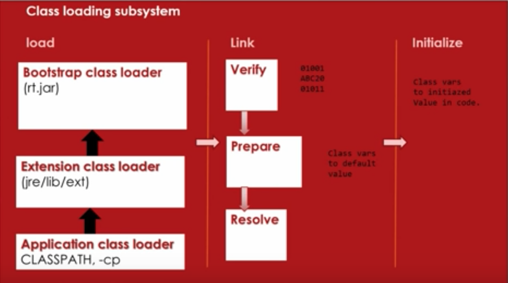
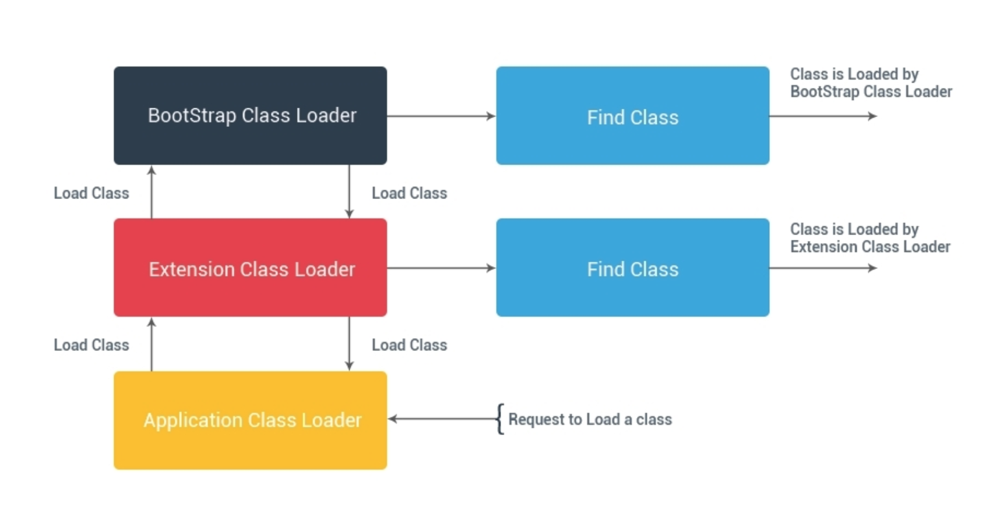
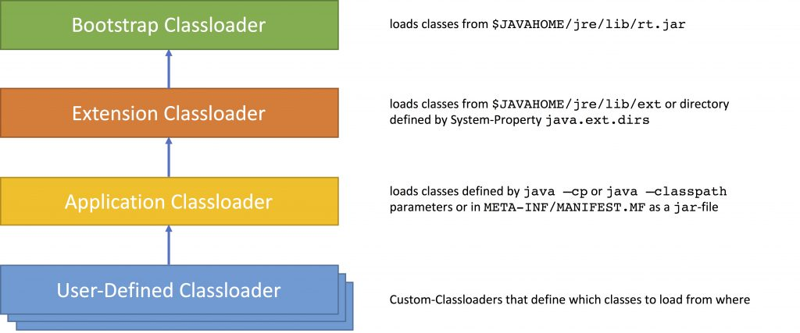
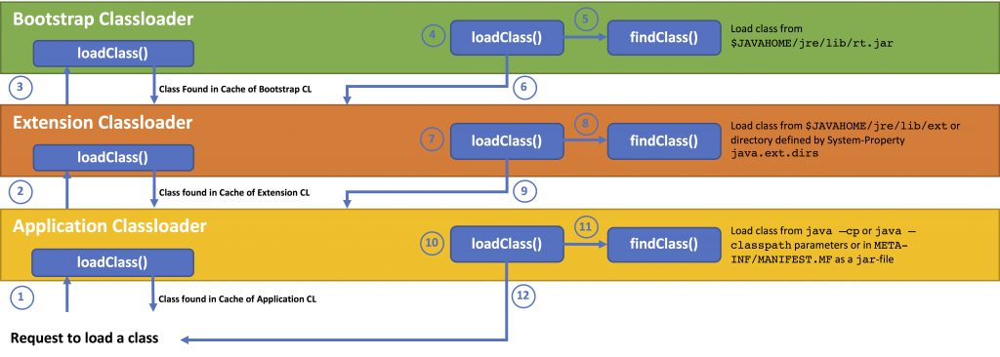

Table of Contents
=================

   * [ClassLoader](#classloader)
      * [Java Byte-Code](#java-byte-code)
      * [What does it mean by saying - load a class?](#what-does-it-mean-by-saying---load-a-class)
      * [ClassLoader Principles](#classloader-principles)
         * [a. <strong>delegation</strong>](#a-delegation)
         * [b. <strong>visibility</strong>](#b-visibility)
         * [c. <strong>uniqueness</strong>](#c-uniqueness)
      * [Hierarchy of Classloaders](#hierarchy-of-classloaders)
      * [Finding and Loading a Class](#finding-and-loading-a-class)
      * [Types of Built-in Class Loaders](#types-of-built-in-class-loaders)
   * [<g-emoji class="g-emoji" alias="soon" fallback-src="https://github.githubassets.com/images/icons/emoji/unicode/1f51c.png">🔜</g-emoji> Create own class loader](#soon-create-own-class-loader)
   * [<g-emoji class="g-emoji" alias="school_satchel" fallback-src="https://github.githubassets.com/images/icons/emoji/unicode/1f392.png">🎒</g-emoji> Memory out of Concepts](#-memory-out-of-concepts)
      * [<g-emoji class="g-emoji" alias="ballot_box_with_check" fallback-src="https://github.githubassets.com/images/icons/emoji/unicode/2611.png">☑️</g-emoji> Advanced Topics](#️-advanced-topics)
      * [<g-emoji class="g-emoji" alias="exclamation" fallback-src="https://github.githubassets.com/images/icons/emoji/unicode/2757.png">❗️</g-emoji> Sometimes ignorance is not bliss](#️-sometimes-ignorance-is-not-bliss)
      * [<g-emoji class="g-emoji" alias="link" fallback-src="https://github.githubassets.com/images/icons/emoji/unicode/1f517.png">🔗</g-emoji> <g-emoji class="g-emoji" alias="pray" fallback-src="https://github.githubassets.com/images/icons/emoji/unicode/1f64f.png">🙏</g-emoji> Reference and Our Thanks to these...](#--reference-and-our-thanks-to-these)
      * [<g-emoji class="g-emoji" alias="arrows_counterclockwise" fallback-src="https://github.githubassets.com/images/icons/emoji/unicode/1f504.png">🔄</g-emoji> UnWind/Recap](#-unwindrecap)
      * [<g-emoji class="g-emoji" alias="microscope" fallback-src="https://github.githubassets.com/images/icons/emoji/unicode/1f52c.png">🔬</g-emoji> More Images](#-more-images)


In this tutorial, we’re going to talk about different types of built-in class loaders, how they work and an introduction to our own custom implementation.

# ClassLoader
<!-- ## What is Java ClassLoader? -->
<!-- We know that Java Program runs on Java Virtual Machine (JVM). When we compile a Java Class, it transforms it in the form of bytecode that is platform and machine independent compiled program and stores it as a .class file. After that when we try to use a Class, Java ClassLoader loads that class into memory. -->

<br>


<p align="center">
  
</p>

<br>

## Java Byte-Code

When you compile java-code (.java files and resources), the compiler will generate so-called `byte-code` (.class files, or packaged .jar files). This byte-code can’t be executed by the local operating system, but only by the Java Runtime Environment (JRE). The JRE is the environment where a Java Virtual Machine (JVM) runs. The benefits are that the byte-code can run on any machine where a JRE is present (providing you haven’t used any operating-system specific code). In addition, **`the Java application runs in a safe space (sandbox) without having much chance to attack the underlying OS`**. Another advantage can be that the byte-code is executed by a just-in-time compiler (JIT compiler). A JIT compiler compiles byte-code into machine-code that can be read and executed by the underlying OS on-the-fly, often with using profiling information to optimise the machine-code.


```
    public class HelloWorld {
        public static void main(String[] args) {
            System.out.println("Hello World.");
        }
    }
```

<div align="right">

<a alt="NoteMe"></a>
</div>

You can see the byte by using
> **javap -c HelloWorld.class**

```
javap -c HelloWorld.class

Compiled from "HelloWorld.java"
public class HelloWorld {
  public HelloWorld();
    Code:
       0: aload_0
       1: invokespecial #1                  // Method java/lang/Object."<init>":()V
       4: return

  public static void main(java.lang.String[]);
    Code:
       0: getstatic     #2                  // Field java/lang/System.out:Ljava/io/PrintStream;
       3: ldc           #3                  // String Hello World.
       5: invokevirtual #4                  // Method java/io/PrintStream.println:(Ljava/lang/String;)V
       8: return
}

```

## What does it mean by saying - load a class?

Source Code in C/C++ is compiled to native machine code first and then it requires a linking step after compilation. What the linking does is combining source files from different places and form an executable program. Java does not do that. The linking-like step for Java is done when they are loaded into JVM.

Different JVMs load classes in different ways, but the basic rule is only loading classes when they are needed. If there are some other classes that are required by the loaded class, they will also be loaded. **```The loading process is recursive```**.

loading policies is handled by a ClassLoader. 
<!-- 
The following example shows how and when a class is loaded for a simple program.

**TestLoader.java**
```
public class TestLoader {
  public static void main(String[] args) {
    System.out.println("test");
  }
}
```


**A.java**
```
public class A {
  public void method(){
    System.out.println("inside of A");
  }
}
```


By running the following command, we can get information about each class loaded. The "**```-verbose:class```**" option displays information about each class loaded.


```
java -verbose:class -classpath /Laughing-buddha/Java/1.JVM/src TestLoader
```


**Part of Output**

```
[Loaded sun.launcher.LauncherHelper$FXHelper from /Library/Java/JavaVirtualMachines/jdk1.8.0_151.jdk/Contents/Home/jre/lib/rt.jar]
[Loaded java.lang.Class$MethodArray from /Library/Java/JavaVirtualMachines/jdk1.8.0_151.jdk/Contents/Home/jre/lib/rt.jar]
[Loaded java.lang.Void from /Library/Java/JavaVirtualMachines/jdk1.8.0_151.jdk/Contents/Home/jre/lib/rt.jar]
test
[Loaded java.lang.Shutdown from /Library/Java/JavaVirtualMachines/jdk1.8.0_151.jdk/Contents/Home/jre/lib/rt.jar]
[Loaded java.lang.Shutdown$Lock from /Library/Java/JavaVirtualMachines/jdk1.8.0_151.jdk/Contents/Home/jre/lib/rt.jar]
```


**Now If we change TestLoader.java to:**

```
public class TestLoader {
  public static void main(String[] args) {
    System.out.println("test");
    A a = new A();
    a.method();
  }
}
```
And run the same command again, the output would be:


```
[Loaded sun.launcher.LauncherHelper$FXHelper from /Library/Java/JavaVirtualMachines/jdk1.8.0_151.jdk/Contents/Home/jre/lib/rt.jar]
[Loaded java.lang.Class$MethodArray from /Library/Java/JavaVirtualMachines/jdk1.8.0_151.jdk/Contents/Home/jre/lib/rt.jar]
[Loaded java.lang.Void from /Library/Java/JavaVirtualMachines/jdk1.8.0_151.jdk/Contents/Home/jre/lib/rt.jar]
test
[Loaded A from file:/Users/charankumar/Documents/PushGitSpace/Laughing-buddha/Java/1.JVM/src/]
inside of A
[Loaded java.lang.Shutdown from /Library/Java/JavaVirtualMachines/jdk1.8.0_151.jdk/Contents/Home/jre/lib/rt.jar]
[Loaded java.lang.Shutdown$Lock from /Library/Java/JavaVirtualMachines/jdk1.8.0_151.jdk/Contents/Home/jre/lib/rt.jar]
```


A.class is loaded only when it is used. In summary, a class is loaded:

- when the new bytecode is executed. For example, SomeClass f = new SomeClass();
- when the bytecodes make a static reference to a class. For example, System.out. -->


<!-- # What class loaders do /work 
Classes are introduced into the Java environment when they are referenced by name in a class that is already running. There is a bit of magic that goes on to get the first class running (which is why you have to declare the main() method as static, taking a string array as an argument), but once that class is running, future attempts at loading classes are done by the class loader. -->


## ClassLoader Principles 
ClassLoader in Java works on three principle :

* **delegation**
* **visibility** 
* **uniqueness** 


### a. **delegation**
**_Delegation principle forward request of class loading to parent class loader and only loads the class, if parent is not able to find or load class_**

When a class is loaded in Java, when its needed. Suppose you have an application specific class called Abc.class, first request of loading this class will come to Application ClassLoader which will delegate to its parent Extension ClassLoader which further delegates to **_Primordial_** or Bootstrap class loader. 


<br>


<p align="center">
  
</p>

<br>


### b. **visibility**
Visibility principle allows child class loader to see all the classes loaded by parent ClassLoader, but parent class loader can not see classes loaded by child.


According to visibility principle, Child ClassLoader can see class loaded by Parent ClassLoader but vice-versa is not true. Which mean if class Abc is loaded by Application class loader than trying to load class ABC explicitly using extension ClassLoader will throw either **```java.lang.ClassNotFoundException```**<sup>[:bulb:](/Java/1.JVM/MiscellaneousExplained.md#)</sup>. as shown in below Example

```
import java.util.logging.Level;
import java.util.logging.Logger;

/**
 * Java program to demonstrate How ClassLoader works in Java,
 * in particular about visibility principle of ClassLoader.
 */

public class ClassLoaderTest {
  
    public static void main(String args[]) {
        try {          
            //printing ClassLoader of this class
            System.out.println("ClassLoaderTest.getClass().getClassLoader() : "
                                 + ClassLoaderTest.class.getClassLoader());

          
            //trying to explicitly load this class again using Extension class loader
            Class.forName("test.ClassLoaderTest", true 
                            ,  ClassLoaderTest.class.getClassLoader().getParent());
        } catch (ClassNotFoundException ex) {
            Logger.getLogger(ClassLoaderTest.class.getName()).log(Level.SEVERE, null, ex);
        }
    }

}
```

**OutPut :**

```
ClassLoaderTest.getClass().getClassLoader() : sun.misc.Launcher$AppClassLoader@6d06d69c
Feb 11, 2019 6:59:17 AM ClassLoaderTest main
SEVERE: null
java.lang.ClassNotFoundException: test.ClassLoaderTest
  at java.net.URLClassLoader.findClass(URLClassLoader.java:381)
  at java.lang.ClassLoader.loadClass(ClassLoader.java:424)
  at java.lang.ClassLoader.loadClass(ClassLoader.java:357)
  at java.lang.Class.forName0(Native Method)
  at java.lang.Class.forName(Class.java:348)
  at ClassLoaderTest.main(ClassLoaderTest.java:21)
```


### c. **uniqueness**
Uniqueness principle allows to load a class exactly once, which is basically achieved by delegation and ensures that child ClassLoader doesn't reload the class already loaded by parent.  


Correct understanding of class loader is must to resolve issues like NoClassDefFoundError in Java and java.lang.ClassNotFoundException, which are related to class loading. 

---


## Hierarchy of Classloaders

A Java program usually consists of many classes that are linked to each other. These classes are loaded and initialised when they are needed during runtime. Java provides a hierarchy of different ClassLoaders that are responsible for this job

<br>


<p align="center">
  
</p>


* **The Bootstrap Classloader** (aka Primordial Classloader) loads the classes of the JRE, classes that can be found in $JAVAHOME/jre/lib/rt.jar. The Bootstrap Classloader is the root of all other the other Classloaders. Most of the classes are implemented in C.
* The **Extension Classloader** loads classes from Extension API under $JAVAHOME/jre/lib/ext (or in the directories defined in the System-Property java.ext.dirs). The Extension Classloader is a sub-class of the Bootstrap Classloader. It is implemented in Java.
* The **Application Classloader** (aka System Classloader) is the default Classloader and loads classes from the classpath (java -cp or java -classpath) or Class-Path attribute of a META-INF/MANIFEST.MF file inside of a jar-file. The System Classloader is also implemented in Java.
* In addition, **Custom Classloader** can be written that can load classes from any location. These User-Defined Classloaders are derived from java.lang.ClassLoader. Custom Classloader are organised as a tree, each Custom Classloader has a parent, the System Classloader is the root Classloader for all Custom Classloaders

## Finding and Loading a Class

The loading of classes happens hierarchically. To load a class, the loadClass() method of the Application Classloader is called (1).


<p align="center">
  
</p>

1. If the Application ClassLoader has already loaded the class it simply returns it. Otherwise, the Application Classloader calls loadClass() on the Extension Classloader (2).
2. If the Extension Classloader has loaded the class already it returns it. Otherwise, the Extension Classloader calls loadClass() on the Bootstrap Classloader (3).
3. If the Bootstrap Classloader has loaded the class already it returns it. Otherwise, the Bootstrap Classloader calls loadClass() (4) which calls findClass() (5), which then tries to find the class in $JAVAHOME/jre/lib/rt.jar, caches (stores) and returns it (6). If the Bootstrap Classloader cannot find the class, it delegates it back to the Extension Classloader (6).
4. The loadClass() method  (7) of the Extension Classloader then calls findClass() (8), which in turn tries to find the class in $JAVAHOME/jre/lib/ext (or in the directories defined in the System-Property java.ext.dirs), caches (stores) and returns it (9). If the Extension Classloader cannot find the class, it delegates it back to the Application Classloader (9).
5. The loadClass() method (10) of the Application Classloader then calls findClass() (11), which in turn tries to find the class in the application classpath (java -cp or java -classpath), caches (stores) and returns it (12). If the Application Classloader cannot find the class, it throws a `java.lang.ClassNotFoundException` to the caller (12).

This principle is also called **`delegation principle`**. A child Classloader can see all classes loaded by the parent Classloader (not vice-versa). The parent Classloader cannot see the classes loaded by the child Classloader `(visibility principle)`. Each Classloader contains `(loads, caches, stores)` the classes it is responsible for (uniqueness principle).

This is a recursive process. To sum it up

* if the Classloader has already loaded the class and returns the class from its cache,
* if not it asks their Parent ClassLoader
* if the Parent ClassLoader doesn’t have the class, the ClassLoader loads it from the associated location

You can experiment this behaviour with some classes like this
```
public class SuperClass {
    public static int A = 200;
    static {
        System.out.println ("Static part of SuperClass.");
    }
    {
        System.out.println("Non-Static part of SuperClass is initialized");
    }
}
```
```
public class SubClass extends SuperClass {
    public static int A = 100;
    static {
        System.out.println ("Static part of SubClass.");
    }
    
    {
        System.out.println("Non-Static part of SubClass is initialized");
    }
}
```

```
public class ClassHierarchyDemo {
    public static void main (String[] args) {
        System.out.println (SubClass.A);
        SubClass subClass = new SubClass();
    }
}
```

You can have a further look at when the classes are loaded with

``` java -verbose:class ClassHierarchyDemo  ```

```
[Opened /Library/Java/JavaVirtualMachines/jdk1.8.0_221.jdk/Contents/Home/jre/lib/rt.jar]
[Loaded java.lang.Object from /Library/Java/JavaVirtualMachines/jdk1.8.0_221.jdk/Contents/Home/jre/lib/rt.jar]
....
....
....
....
....
[Loaded SubClass from file:/Users/charankumar/]
Static part of SuperClass.
Static part of SubClass.
100
Non-Static part of SuperClass is initialized
Non-Static part of SubClass is initialized
[Loaded java.lang.Shutdown from /Library/Java/JavaVirtualMachines/jdk1.8.0_221.jdk/Contents/Home/jre/lib/rt.jar]
```


In summary, a class is loaded:

- when the new bytecode is executed. For example, SomeClass f = new SomeClass();
- when the bytecodes make a static reference to a class. For example, System.out.

<div align="right">
<a href="../../TopicsExplained.md#shutdown-hooks" alt=""></a>
</div>

<!-- ## How does Java ClassLoader Work?


A Java program usually consists of many classes that are linked to each other like above `TestLoader.java` example. These classes are loaded and initialised when they are needed during runtime. Java provides a hierarchy of different ClassLoaders that are responsible for this job


* When JVM requests for a class, it invokes `loadClass` function of the ClassLoader by passing the fully classified name of the Class.

* loadClass function calls for `findLoadedClass()` method to check that the class has been already loaded or not. It’s required to avoid loading the class multiple times.

* If the Class is not already loaded then it will delegate the request to parent ClassLoader to load the class.

* If the parent ClassLoader is not finding the Class then it will invoke findClass() method to look for the classes in the file system. -->


--- 

## Types of Built-in Class Loaders

Let’s start by learning how different classes are loaded using various class loaders using a simple example:
```
public void printClassLoaders() throws ClassNotFoundException {
 
    System.out.println("Classloader of this class:"
        + PrintClassLoader.class.getClassLoader());
 
    System.out.println("Classloader of Logging:"
        + Logging.class.getClassLoader());
 
    System.out.println("Classloader of ArrayList:"
        + ArrayList.class.getClassLoader());
}
```

When executed the above method prints:


```
Class loader of this class:sun.misc.Launcher$AppClassLoader@18b4aac2
Class loader of Logging:sun.misc.Launcher$ExtClassLoader@3caeaf62
Class loader of ArrayList:null
```

As we can see, there are three different class loaders here; **application, extension, and bootstrap** (displayed as null).

* The **application** class loader loads the class where the example method is contained. An application or system class loader loads our own files in the classpath.

* Next, the **extension** one loads the Logging class. Extension class loaders load classes that are an extension of the standard core Java classes.

* Finally, the **bootstrap** one loads the ArrayList class. A bootstrap or primordial class loader is the parent of all the others.

> 🤔❓ However, we can see that the last out, for the ArrayList it displays null in the output. **This is because the bootstrap class loader is written in native code**, not Java – so it doesn’t show up as a Java class. Due to this reason, the behavior of the bootstrap class loader will differ across JVMs.


[Click here for More reading](https://javarevisited.blogspot.com/2012/12/how-classloader-works-in-java.html)


<br>


# :soon: Create own class loader
- https://www.javaworld.com/article/2077260/learn-java/learn-java-the-basics-of-java-class-loaders.html
- https://www.baeldung.com/java-classloaders
- https://www.journaldev.com/349/java-classloader
- https://www.journaldev.com/349/java-classloader#why-write-a-custom-classloader-in-java

<br>

:envelope:

- Class Loaders
    - https://www.ibm.com/developerworks/library/j-dyn0429/
    - https://www.baeldung.com/java-classloaders
- Initialisers : https://www.programcreek.com/2011/10/java-class-instance-initializers


# 🎒 Memory out of Concepts
## ☑️ Advanced Topics
## ❗️ Sometimes ignorance is not bliss
## 🔗 🙏 Reference and Our Thanks to these...
- https://javarevisited.blogspot.com/2011/08/classnotfoundexception-in-java-example.html#axzz5fBEERW8K
- https://dev.vividbreeze.com/jvm-classloading/
- https://www.baeldung.com/java-classloaders
- https://www.journaldev.com/349/java-classloader
- 
## 🔄 UnWind/Recap

## 🔬 More Images