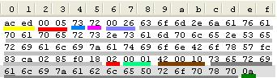
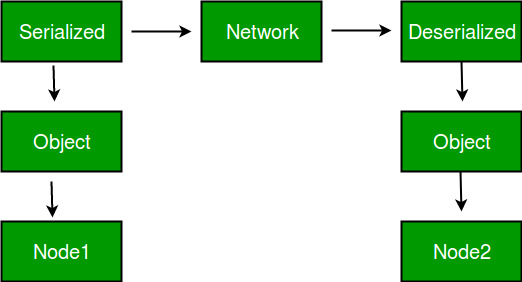
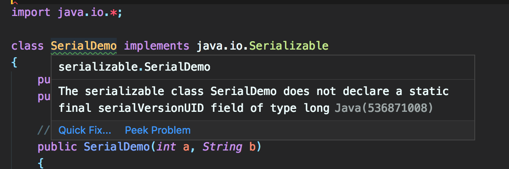

Table of Contents
=================

   * [Introduction](#introduction)
      * [What is Java Serialization?](#what-is-java-serialization)
      * [Advantages of Serialization](#advantages-of-serialization)
      * [How to Make a Java Class Serializable?](#how-to-make-a-java-class-serializable)
      * [Points to remember](#points-to-remember)
   * [serialVersionUID](#serialversionuid)
      * [What Is the serialVersionUID?](#what-is-the-serialversionuid)
      * [Why serialVersionUID?](#why-serialversionuid)
      * [How serialVersionUID is generated?](#how-serialversionuid-is-generated)
      * [How serialVersionUID works?](#how-serialversionuid-works)
      * [Demonstrate serialVersionUID](#demonstrate-serialversionuid)
   * [Exploring Java Serialization](#exploring-java-serialization)
   * [Transient Keyword](#transient-keyword)
      * [Transient Vs. Static](#transient-vs-static)
      * [Final Vs. Transient](#final-vs-transient)
   * [<g-emoji class="g-emoji" alias="exclamation" fallback-src="https://github.githubassets.com/images/icons/emoji/unicode/2757.png">❗️</g-emoji> Sometimes ignorance is not bliss](#exclamation-sometimes-ignorance-is-not-bliss)
   * [Reference](#reference)


#   Introduction

When you create a class, you may create an object for that particular class and once we execute/terminate the program, the object is destroyed by itself via the garbage collector thread.

_What happens if you want to call that class without re-creating the object?_ In those cases, what you do is use the serialization concept by converting data into a byte stream.

**Object Serialization** is a process used to convert the state of an object into a byte stream, which can be persisted into disk/file or sent over the network to any other running Java virtual machine. The reverse process of creating an object from the byte stream is called **deserialization**. The byte stream created is platform independent. So, the object serialized on one platform can be deserialized on a different platform.


>   Serialization is a mechanism of converting the state of an object into a byte stream. Deserialization is the reverse process where the byte stream is used to recreate the actual Java object in memory. This mechanism is used to persist the object.


## What is Java Serialization?

Primary purpose of java serialization is to write an object into a stream, so that it can be transported through a network and that object can be rebuilt again. When there are two different parties involved, you need a protocol to rebuild the exact same object again. Java serialization API just provides you that. Other ways you can leverage the feature of serialization is.


<p align="center"> 
    
 </p>

 `The byte stream created is platform independent. So, the object serialized on one platform can be deserialized on a different platform.`


 ## Advantages of Serialization
1. To save/persist state of an object.
2. To travel an object across a network.

<p align="center"> 
    
 </p>


## How to Make a Java Class Serializable?
Serializability can be enabled in your Java class by implementing the java.io.Serializable interface. **Serializable is a marker interface** (has no data member and method). It is used to “mark” java classes so that objects of these classes may get certain capability. The serialization interface has no methods or fields and serves only to identify the semantics of being serializable.

Other examples of marker interfaces are:- Cloneable and Remote.

Only the objects of those classes can be serialized which are implementing java.io.Serializable interface.


The _**ObjectOutputStream**_ class contains writeObject() method for serializing an Object.
The writeObject method is responsible for writing the state of the object for its particular class so that the corresponding readObject method can restore it. 
```
public final void writeObject(Object obj)
                       throws IOException
```
The _**ObjectInputStream**_ class contains readObject() method for deserializing an object.
```
public final Object readObject()
                  throws IOException,
               ClassNotFoundException
```


## Points to remember
1. **Only non-static data members are saved via Serialization process.**
2. If a parent class has implemented Serializable interface then child class doesn’t need to implement it but vice-versa is not true.
3. Static data members and transient data members are not saved via Serialization process. So, if you don’t want to save value of a non-static data member then make it *transient*.
4. Constructor of object is never called when an object is deserialized.
5. Associated objects must be implementing Serializable interface.


---

# serialVersionUID
## What Is the serialVersionUID?

**_SerialVersionUID_** is an ID, which is stamped on an object when it gets serialized . 

The Serialization runtime associates a version number with each Serializable class called a SerialVersionUID, which is used during Deserialization to verify that sender and reciever of a serialized object have loaded classes for that object which are compatible with respect to serialization. 


If the reciever has loaded a class for the object that has different UID than that of corresponding sender’s class, the Deserialization will result in an `InvalidClassException`. A Serializable class can declare its own UID explicitly by declaring a field name.

_**It must be static, final and of type long.**_
> ANY-ACCESS-MODIFIER static final long serialVersionUID=42L;

<!-- If a serializable class doesn’t _explicitly_ declare a serialVersionUID, then the serialization runtime will calculate a default one for that class based on various aspects of class like usually with the hashcode of the object, as described in Java Object Serialization Specification. 

However it is strongly recommended that all serializable classes explicitly declare serialVersionUID value, since its computation is highly sensitive to class details that may vary depending on compiler implementations, any change in class or using different id may affect the serialized data.

It is also recommended to use private modifier for UID since it is not useful as inherited member. -->


## Why serialVersionUID?

Lets start with annoying warning message you get in your IDE when you declare a class as Serializable.

The serializable class SerialDemo does not declare a static final serialVersionUID field of type long

Most of us used to ignore this message as we always do for a warning. My general note is, always pay attention to the java warning messages. It will help you to learn a lot of fundamentals.

<p align="center"> 
    
 </p>

serialVersionUID is a must in serialization process. But it is optional for the developer to add it in java source file. If you are not going to add it in java source file, serialization runtime will generate a serialVersionUID and associate it with the class. The serialized object will contain this serialVersionUID along with other data.

**Even though serialVersionUID is a static field, it gets serialized along with the object. This is one exception to the general serialization rule that, “static fields are not serialized”**.


## How serialVersionUID is generated?

serialVersionUID is a 64-bit hash of the class name, interface class names, methods and fields. Serialization runtime generates a serialVersionUID if you do not add one in source.

It is advised to have serialVersionUID as unique as possible. Thats why the java runtime chose to have such a complex algorithm to generate it.

If you want help in generating it, jdk tools provides a tool named serialver. 

Use **`serialver -show`** to start the gui version of the tool as shown below.

```
root: serializable > serialver SerialDemo
SerialDemo:    private static final long serialVersionUID = -5531068915378797524L;

```


## How serialVersionUID works?
When an object is serialized, the serialVersionUID is serialized along with the other contents.

Later when that is deserialized, the serialVersionUID from the deserialized object is extracted and compared with the serialVersionUID of the loaded class.

If the numbers do not match then, InvalidClassException is thrown.

If the loaded class is not having a serialVersionUID declared, then it is automatically generated using the same algorithm as before.


## Demonstrate serialVersionUID

Initial class to be serialized has a serialVersionUID as 1L.

```
import java.io.Serializable;

class Lion implements Serializable {

    private final static long serialVersionUID = 1L;
    private String sound;

    public Lion(String sound) {
        this.sound = sound;
    }

    public String getSound() {
        return sound;
    }
}
```
Test serialVersionUID:

```
import java.io.FileInputStream;
import java.io.FileOutputStream;
import java.io.IOException;
import java.io.ObjectInputStream;
import java.io.ObjectOutputStream;

class SerialVersionUIDTest {
    public static void main(String argsp[]) throws IOException, ClassNotFoundException {
        Lion leo = new Lion("roar");

        // Serialize
        FileOutputStream fos = new FileOutputStream("serial.out");
        ObjectOutputStream oos = new ObjectOutputStream(fos);
        oos.writeObject(leo);

        // DeSerialize
        FileInputStream fis = new FileInputStream("serial.out");
        ObjectInputStream ois = new ObjectInputStream(fis);
        Lion obj = (Lion) ois.readObject();

        System.out.println("\n Deserialized lion :" + obj.getSound());
    }
}

```

**OutPut** : 
  
   Deserialized lion :roar

`Now change serialVersionUID to 2L in Lion class.`

> private static final long serialVersionUID = 2L;

Comment the “serialize” block (4 lines of code) in SerialVersionUIDTest. Now run it and you will get the following exception.

1. Serialized Lion with serialVersionUID with 1L.
2. Changed serialVersionUID to 2L and compiled and loaded the class.
3. Deserialize the already serialized object and load it with the latest class.
4. We get exception as serialVersionUID is not matching.

```
Exception in thread "main" java.io.InvalidClassException: Lion; local class incompatible: stream classdesc serialVersionUID = 1, local class serialVersionUID = 2
	at java.io.ObjectStreamClass.initNonProxy(ObjectStreamClass.java:687)
	at java.io.ObjectInputStream.readNonProxyDesc(ObjectInputStream.java:1880)
	at java.io.ObjectInputStream.readClassDesc(ObjectInputStream.java:1746)
	at java.io.ObjectInputStream.readOrdinaryObject(ObjectInputStream.java:2037)
	at java.io.ObjectInputStream.readObject0(ObjectInputStream.java:1568)
	at java.io.ObjectInputStream.readObject(ObjectInputStream.java:428)
	at SerialVersionUIDTest.main(SerialVersionUIDTest.java:19)

   ```

---

# Exploring Java Serialization


Look at following image. After serializing Let us look at contents byte by byte and find out what they are. It starts with “ac ed”. It is is called **`STREAM_MAGIC`**. It is a magic number (java API guys says) that is written to the stream header. It denotes that is start of serialzed content.

<p align="center"> 
    
 </p>


In the image, I have underline a unit of information in a separate color for you to easily identify.

*  ac ed – STREAM_MAGIC – denotes start of serialzed content
*  00 05 – STREAM_VERSION – serialization version
*  73 – TC_OBJECT – new Object
*  72 – TC_CLASSDESC – new Class Descriptor
*  00 26 – length of the class name
*  63 6f 6d 2e 6a 61 76 61 70 61 70 65 72 73 2e 73 61 6d 70 6c 65 2e 53 65 72 69 61 6c 69 7a 61 74 69 6f 6e 42 6f 78 – class name
*  57 fc 83 ca 02 85 f0 18 – SerialVersionUID
*  02 – this object is serializable
*  00 01 – count of properties in the serialzed class – one property in our example
*  42 00 10 – private byte
*  73 65 72 69 61 6c 69 7a 61 62 6c 65 50 72 6f 70 78 70 – property name – serializableProp in our example
*  0a – 10 the value – This is the persisted value of the property in our sample


---

# Transient Keyword
The transient modifier/keyword is applicable only for variables but not for methods and classes.
At the time of serialization, if we don't want to serialize the value of a particular variable to meet security constraints, then we should declare that variable as transient.

While performing serialization, the JVM ignores the original value of the transient variable and save default value to the file. **`Hence, transient means not to serialize`**.

## Transient Vs. Static
A static variable is not part of an object state, and hence, it won't participate in serialization. Due to this declaring static variable as transient, there is no use.

## Final Vs. Transient
Final variables will be participated in serialization directly by the value. Hence, declaring a final variable as transient causes no impact.


---


# :exclamation: Sometimes ignorance is not bliss 

:bulb: **`Only non-static data members are saved via Serialization process`** : 


:bulb: **`What if We Are Trying to Serialize a Non-Serializable Object?`**
We will get a RuntimeException saying: Exception in thread "main" java.io.NotSerializableException: java.io.ObjectOutputStream.


:bulb: **`Java Serialization with Inheritance (IS-A Relationship)`**

If a class implements serializable then all its sub classes will also be serializable. Let's see the example given below:
```
import java.io.Serializable;  
class Person implements Serializable{  
 int id;  
 String name;  
 Person(int id, String name) {  
  this.id = id;  
  this.name = name;  
 }  
}  
```
```
class Student extends Person{  
 String course;  
 int fee;  
 public Student(int id, String name, String course, int fee) {  
  super(id,name);  
  this.course=course;  
  this.fee=fee;  
 }  
}  
```
Now you can serialize the Student class object that extends the Person class which is Serializable. Parent class properties are inherited to subclasses so if parent class is Serializable, subclass would also be.

:bulb: **`Java Serialization with Aggregation (HAS-A Relationship)`**
If a class has a reference to another class, all the references must be Serializable otherwise serialization process will not be performed. In such case, NotSerializableException is thrown at runtime.
```
class Address{  
 String addressLine,city,state;  
 public Address(String addressLine, String city, String state) {  
  this.addressLine=addressLine;  
  this.city=city;  
  this.state=state;  
 }  
}  
```
```
import java.io.Serializable;  
public class Student implements Serializable{  
 int id;  
 String name;  
 Address address;//HAS-A  
 public Student(int id, String name) {  
  this.id = id;  
  this.name = name;  
 }  
} 
```

> Since Address is not Serializable, you can not serialize the instance of Student class.

**Note: All the objects within an object must be Serializable.**

:bulb: **`Java Serialization with the static data member`**

If there is any static data member in a class, it will not be serialized **because static is the part of class not object**.

```
class Employee implements Serializable{  
 int id;  
 String name;  
 static String company="SSS IT Pvt Ltd";//it won't be serialized  
 public Student(int id, String name) {  
  this.id = id;  
  this.name = name;  
 }  
}  
```


#   Reference
- https://www.geeksforgeeks.org/serialization-in-java/
-  :on: [Serialization in Java – Java Serialization](https://www.journaldev.com/2452/serialization-in-java)
-   - :ballot_box_with_check: [Serialization and De-Serialization in Java](https://dzone.com/articles/serialization-amp-de-serialization-in-java) **done**
- serialversionuid
    -   - :ballot_box_with_check: :heart: https://javapapers.com/core-java/serialversionuid-in-java-serialization/ **Done**
    -   https://www.mkyong.com/java-best-practices/understand-the-serialversionuid/
    -    - :ballot_box_with_check: https://javapapers.com/core-java/java-serialization/ **Done**
