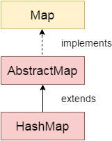

#  1.  Introduction

**`HashMap`** in Java in a collection class which implements **`Map`** interface. It is used to store key & value pairs. Each key is mapped to a single value in the map.

Keys are unique. It means we can insert a key ‘K’ only once in a map. Duplicate keys are not allowed. Though a value 'V' can be mapped to multiple keys.


#  2. java.util.HashMap Class

##  HashMap class declaration
HashMap has been declared as following:

HashMap class declaration
```
public class HashMap<K,V> extends AbstractMap<K,V>
                implements Map<K,V>, Cloneable, Serializable 
```


##  HashMap class Hierarchy
As shown above, HashMap implements `Map interface` and extends `AbstractMap class`.

<p align="center">
  
</p>


#   3. Java HashMap Features
*   HashMap **`cannot contain`** duplicate keys.
*   HashMap allows multiple null values **`but only`** one null key.
*   HashMap is an **`unordered`** collection. It does not guarantee any specific order of the elements.
*   HashMap is not thread-safe. You must explicitly synchronize concurrent modifications to the HashMap. Or you can use `Collections.synchronizedMap(hashMap)` to get the synchronized version of HashMap.
*   A value can be retrieved only using the associated key.
*   HashMap stores only **`object references`**. So primitives must be used with their corresponding wrapper classes. Such as int will be stored as Integer.
*   HashMap implements Cloneable and Serializable interfaces.


#  Explore
-  :on: [A Guide to HashMap in Java](https://howtodoinjava.com/java-hashmap/)

#  Reference
