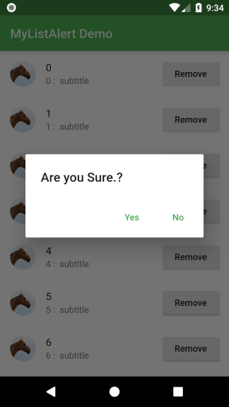
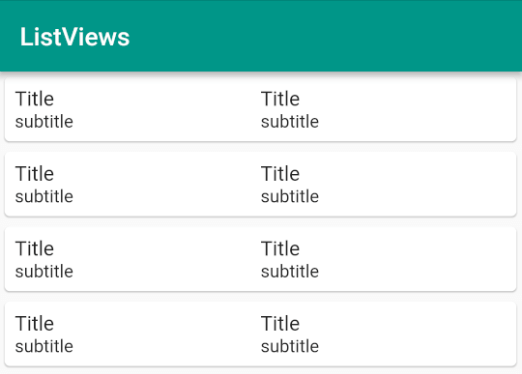
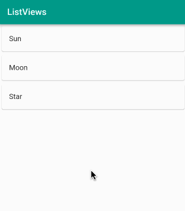
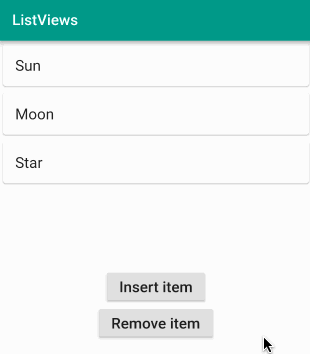

Table of Contents
=================

   * [Toursim&amp;Co](#toursimco)
   * [Layout](#layout)
      * [Build Layout](#build-layout)
         * [1. Build a basic flutter app with layout](#1-build-a-basic-flutter-app-with-layout)
         * [2. Refactor the Code](#2-refactor-the-code)
         * [3. Minimise the repetitions.](#3-minimise-the-repetitions)
   * [LISTS:](#lists)
      * [a. ListTile with Toast](#a-listtile-with-toast)
      * [b. ListView With AlertDialogue](#b-listview-with-alertdialogue)
      * [ListView With Custom list item](#listview-with-custom-list-item)
      * [Updating list data](#updating-list-data)
         * [a. Adding and deleting rows in a ListView](#a-adding-and-deleting-rows-in-a-listview)
         * [b. Adding and deleting rows in an AnimatedList](#b-adding-and-deleting-rows-in-an-animatedlist)


# Toursim&Co
Thanks to 
# 
here in this tutorial we build a basic flutter app which explains `Container` , ``

1. Build a basic flutter app with layout (Containers,Columns,mainAxisAlignment etc)
2. Refactor the Code.
3. Minimise the repetitions.

# Layout 
## Build Layout 
### 1. Build a basic flutter app with layout

> Lesson Goals
- Add three colored boxes to the screen.
- Layout each box from top to bottom, with each item stretched.


**Container**

"A convenience widget that combines common painting, positioning, and sizing widgets." (source) It’s basically the “<div>” of Flutter. 
Each Container has a “child” element, which allows us to nest elements. 
Let’s specify a “decoration”, allowing us “to paint behind the child.” in order to set the background color. We assign it a BoxDecoration. "The BoxDecoration class provides a variety of ways to draw a box." 

“Color” is a class that provides predefined colors for us. Each member being static and const. “static” values are available on the class itself, rather than a class instance. “const” is a value that is defined at compile time and cannot change when the app is running.
Now let’s a column based layout.


**Column**

“A widget that displays its children in a vertical array.” (source)
Let’s add three containers to show how they are painted. Note:  In terms of layout, “container tries, in order: to honor alignment, to size itself to the child, to honor the width, height, and constraints, to expand to fit the parent, to be as small as possible.” 


**mainAxisAlignment and crossAxisAlignment**

These properties of Column are used to control how content is aligned along the “main axis” of the column, which is a vertical line. 
 
 
We can change it to “end” or “space evenly” and see what happens.
 
crossAxisAlignment is used to control how content is aligned along the opposing axis. So since we are using a Column, and its main axis is vertical, the “cross axis” will be perpendicular or horizontal. 
 
So if we set crossAxisAlignment to say, “stretch”, a common value, each child of the Column will be stretched.


```
import 'package:flutter/material.dart';

void main() {
  runApp(MaterialApp(
      home: Scaffold(
          appBar: AppBar(
            title: Text("Hello World"),
          ),
          body: Column(
            mainAxisAlignment: MainAxisAlignment.start,
            crossAxisAlignment: CrossAxisAlignment.stretch,
            children: <Widget>[
              Container(
                decoration: BoxDecoration(color: Colors.green[500]),
                child: Text("One"),
              ),
              Container(
                decoration: BoxDecoration(color: Colors.grey[500]),
                child: Text("Two"),
              ),
              Container(
                decoration: BoxDecoration(color: Colors.blue[500]),
                child: Text("Threeeeeeeeee"),
              ),
            ],
          ))
          ));
}

```

### 2. Refactor the Code

Now lets refactor the code ,lets break the code in to two parts - `main.dart` & `locationDetails.dart`

```
main.dart

import 'package:flutter/material.dart';
import 'locationDetails.dart';

void main() {
  runApp(MaterialApp(
      home: LocationDetails(),
          ));
}
```


```
locationDetails.dart

import 'package:flutter/material.dart';

class LocationDetails extends StatelessWidget {
  Widget build(BuildContext context) {
    return Scaffold(
        appBar: AppBar(
          title: Text("Hello World"),
        ),
        body: Column(
          mainAxisAlignment: MainAxisAlignment.start,
          crossAxisAlignment: CrossAxisAlignment.stretch,
          children: <Widget>[
            Container(
              decoration: BoxDecoration(color: Colors.green[500]),
              child: Text("One"),
            ),
            Container(
              decoration: BoxDecoration(color: Colors.grey[500]),
              child: Text("Two"),
            ),
            Container(
              decoration: BoxDecoration(color: Colors.blue[500]),
              child: Text("Three"),
            ),
          ],
        ));
  }
}
```


### 3. Minimise the repetitions.


we can see in step 2 most of the times we repetitively calling Container code...so lets make a method for Container section.


```

import 'package:flutter/material.dart';

class LocationDetails extends StatelessWidget {
  Widget build(BuildContext context) {
    return Scaffold(
        appBar: AppBar(
          title: Text("Hello World"),
        ),
        body: Column(
          mainAxisAlignment: MainAxisAlignment.start,
          crossAxisAlignment: CrossAxisAlignment.stretch,
          children: <Widget>[
            _section("One", Colors.red),
            _section("Two", Colors.green),
            _section("Three", Colors.blue),
          ],
        ));
  }

  Widget _section(String title, Color color) {
    return Container(
      decoration: BoxDecoration(color: color),
      child: Text(title),
    );
  }
}

```

**Note** :  `_Section` refers to a Private method, which is only accesible with in this dart file


# LISTS:
## a. ListTile with Toast
tags : `ListTile` `Toast` 


  <p align="center"> 
    
 </p>


```

import 'package:flutter/material.dart';
import 'package:toast/toast.dart';

void main() => runApp(MyListTile());

class MyListTile extends StatelessWidget {
  @override
  Widget build(BuildContext context) {
    return MaterialApp(
      debugShowCheckedModeBanner: false,
      theme: ThemeData(
        primarySwatch: Colors.green,
      ),
      home: Scaffold(
        appBar: AppBar(
          title: Text("ListTile Demo"),
        ),
        body: BodyWidget(),
      ),
    );
  }
}

String horseUrl = 'https://i.stack.imgur.com/Dw6f7.png';
String cowUrl = 'https://i.stack.imgur.com/XPOr3.png';
String camelUrl = 'https://i.stack.imgur.com/YN0m7.png';
String sheepUrl = 'https://i.stack.imgur.com/wKzo8.png';
String goatUrl = 'https://i.stack.imgur.com/Qt4JP.png';

class BodyWidget extends StatelessWidget {
  @override
  Widget build(BuildContext context) {
    return ListView(
      children: <Widget>[
        _getTile(horseUrl, "Horse", "horse",context),
        _getTile(cowUrl, "Cow", "cow",context),
        _getTile(camelUrl, "Camel", "camel",context),
        _getTile(sheepUrl, "Sheep", "sheep",context),
        _getTile(goatUrl, "Goat", "goat",context),
      ],
    );
  }
}

Widget _getTile(String myurl, String title, String subtitle,BuildContext context) {
  return ListTile(
    leading: CircleAvatar(
      backgroundImage: NetworkImage(myurl),
      // child: Icon(Icons.hourglass_full),
    ),
    title: Text(title),
    subtitle: Text(subtitle),
    trailing: Icon(Icons.keyboard_arrow_right),
    // dense: true,
    selected: true,
    // enabled: false,
    onTap: (){
      Toast.show(title, context, duration: Toast.LENGTH_LONG, gravity:  Toast.BOTTOM);
      // Scaffold.of(context).showSnackBar(new SnackBar(
      // content: new Text("Sending Message")),
    // );
    },
  );
}

```
**Note :** Add toast dependency in pubspec.yaml

```
dependencies:
  toast: ^0.1.3
```


## b. ListView With AlertDialogue

tags : `Future`, `alertdialogue`

<p align="center"> 
    
 </p>

```
import 'package:flutter/material.dart';

void main() => runApp(MyListAlert());

class MyListAlert extends StatelessWidget {
  @override
  Widget build(BuildContext context) {
    return MaterialApp(
      debugShowCheckedModeBanner: false,
      theme: ThemeData(
        primarySwatch: Colors.green,
        // backgroundColor: Colors.blue,
      ),
      home: WidgetScreen(),
    );
  }
}

class WidgetScreen extends StatelessWidget {
  @override
  Widget build(BuildContext context) {
    return Scaffold(
      appBar: AppBar(
        title: Text("MyListAlert Demo"),
        toolbarOpacity: 0.7,
      ),
      body: ListView.builder(
        itemBuilder: (context, position) {
          return _MyListView(context, position);
        },
        itemCount: 20,
      ),
    );
  }
}

Widget _MyListView(BuildContext context, int position) {
  return new ListTile(
    leading: CircleAvatar(
      backgroundImage: NetworkImage('https://i.stack.imgur.com/Dw6f7.png'),
    ),
    title: Text("$position"),
    subtitle: Text("$position :  subtitle"),
    trailing: new RaisedButton(
      onPressed: () {
        deleteDialogue(context).then((value) {
          print('Value if $value');
        });
      },
      child: Text("Remove"),
    ),
  );
}

Future<bool> deleteDialogue(BuildContext context) {
  return showDialog(
      context: context,
      barrierDismissible: false,
      builder: (BuildContext context) {
        return new AlertDialog(
          title: new Text("Are you Sure.?"),
          actions: <Widget>[
            new FlatButton(
              child: Text('Yes'),
              onPressed: () {
                Navigator.of(context).pop(true);
              },
            ),
            new FlatButton(
              child: Text('No'),
              onPressed: () {
                Navigator.of(context).pop(true);
              },
            ),
          ],
        );
      });
}

```

## ListView With Custom list item
If a ListTile doesn't fit your needs, you are free to design your own tile. Remember, all that ListView wants is a list of widgets. Any widget is fine. I recently worked on an app that required multiple columns in each list item. Here is a simplified example.

<p align="center"> 
    
 </p>


```

  Widget _myListView(BuildContext context) {

      // the Expanded widget lets the columns share the space
      Widget column = Expanded(
        child: Column(
          // align the text to the left instead of centered
          crossAxisAlignment: CrossAxisAlignment.start,
          children: <Widget>[
            Text('Title', style: TextStyle(fontSize: 16),),
            Text('subtitle'),
          ],
        ),
      );

      return ListView.builder(
        itemBuilder: (context, index) {
          return Card(
            child: Padding(
              padding: const EdgeInsets.all(8.0),
              child: Row(
                children: <Widget>[
                  column,
                  column,
                ],
              ),
            ),
          );
        },
      );

    }

```


## Updating list data 
### a. Adding and deleting rows in a ListView
It is pretty easy to update the items in a normal ListView. All you have to do is use a Stateful widget and call setState() whenever the row data changes.

Since we need a Stateful widget, replace both BodyLayout and _myListView() with the following code:


<p align="center"> 
    
 </p>

When you tap an item it adds a "Planet" item at that index. When you long press an item, it removes it.


```

    class BodyLayout extends StatefulWidget {
      @override
      BodyLayoutState createState() {
        return new BodyLayoutState();
      }
    }

    class BodyLayoutState extends State<BodyLayout> {

      List<String> titles = ['Sun', 'Moon', 'Star'];

      @override
      Widget build(BuildContext context) {
        return _myListView();
      }

      Widget _myListView() {
        return ListView.builder(
          itemCount: titles.length,
          itemBuilder: (context, index) {
            final item = titles[index];
            return Card(
              child: ListTile(
                title: Text(item),

                onTap: () { //                                  <-- onTap
                  setState(() {
                    titles.insert(index, 'Planet');
                  });
                },

                onLongPress: () { //                            <-- onLongPress
                  setState(() {
                    titles.removeAt(index);
                  });
                },

              ),
            );
          },
        );
      }
    }


```


### b. Adding and deleting rows in an AnimatedList
Replace the BodyLayoutState class with the following code:
```
    class BodyLayoutState extends State<BodyLayout> {

      // The GlobalKey keeps track of the visible state of the list items
      // while they are being animated.
      final GlobalKey<AnimatedListState> _listKey = GlobalKey();

      // backing data
      List<String> _data = ['Sun', 'Moon', 'Star'];

      @override
      Widget build(BuildContext context) {
        return Column(
          children: <Widget>[
            SizedBox(
              height: 300,
              child: AnimatedList(
                // Give the Animated list the global key
                key: _listKey,
                initialItemCount: _data.length,
                // Similar to ListView itemBuilder, but AnimatedList has
                // an additional animation parameter.
                itemBuilder: (context, index, animation) {
                  // Breaking the row widget out as a method so that we can
                  // share it with the _removeSingleItem() method.
                  return _buildItem(_data[index], animation);
                },
              ),
            ),
            RaisedButton(
              child: Text('Insert item', style: TextStyle(fontSize: 20)),
              onPressed: () {
                _insertSingleItem();
              },
            ),
            RaisedButton(
              child: Text('Remove item', style: TextStyle(fontSize: 20)),
              onPressed: () {
                _removeSingleItem();
              },
            )
          ],
        );
      }

      // This is the animated row with the Card.
      Widget _buildItem(String item, Animation animation) {
        return SizeTransition(
          sizeFactor: animation,
          child: Card(
            child: ListTile(
              title: Text(
                item,
                style: TextStyle(fontSize: 20),
              ),
            ),
          ),
        );
      }

      void _insertSingleItem() {
        String newItem = "Planet";
        // Arbitrary location for demonstration purposes
        int insertIndex = 2;
        // Add the item to the data list.
        _data.insert(insertIndex, newItem);
        // Add the item visually to the AnimatedList.
        _listKey.currentState.insertItem(insertIndex);
      }

      void _removeSingleItem() {
        int removeIndex = 2;
        // Remove item from data list but keep copy to give to the animation.
        String removedItem = _data.removeAt(removeIndex);
        // This builder is just for showing the row while it is still
        // animating away. The item is already gone from the data list.
        AnimatedListRemovedItemBuilder builder = (context, animation) {
          return _buildItem(removedItem, animation);
        };
        // Remove the item visually from the AnimatedList.
        _listKey.currentState.removeItem(removeIndex, builder);
      }
    }

```

This is the result:

<p align="center"> 
    
 </p>


Read through the comments that I added to the code above. Here are some important points about AnimatedLists:

An AnimatedList needs a GlobalKey that keeps track of the widgets while they are being animated. Every time you make a change to the list, you need to update both the backing data list and the global key.
Our row widgets are stateless, but if your rows have state, then you will need a key for them, too. This helps the system know when a change actually happens. See this video from the Flutter team for more about that.
I used a SizedTransition as the animation here, but see the documentation for other options.