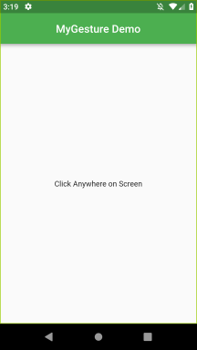
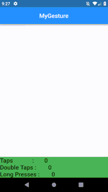
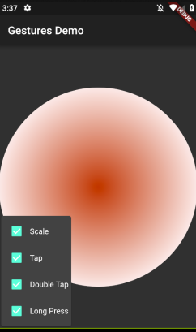

- [Flutter Gestures](#flutter-gestures)
  - [Pointers](#pointers)
    - [**PointerDownEvents**](#pointerdownevents)
    - [**PointerMoveEvents**](#pointermoveevents)
    - [**PointerUpEvents**](#pointerupevents)
    - [**PointerCancelEvents**](#pointercancelevents)
  - [Gestures](#gestures)
    - [**Tap**](#tap)
    - [**Double Tap**](#double-tap)
    - [**Drag**](#drag)
      - [**Horizontal Drag**](#horizontal-drag)
      - [**Vertical Drag**](#vertical-drag)
    - [**Long Press**](#long-press)
    - [**Pan**](#pan)
    - [**Pinch**](#pinch)
- [Gesture Detector](#gesture-detector)
- [So what is the Gesture Detector? How does it work?](#so-what-is-the-gesture-detector-how-does-it-work)
    - [Example 1](#example-1)
    - [Gesture count with Stateful widget :](#gesture-count-with-stateful-widget)
  - [Challengers :](#challengers)

<p align="center">

<a></a>
<a></a>
<a></a>

</p>Tags:

# Flutter Gestures

`Gestures` are an interesting feature in Flutter that allows us to interact with the mobile app (or any touch-based device). Generally, gestures define any physical action or movement of a user in the intention of specific control of the mobile device. Some of the examples of gestures are:

- When the mobile screen is locked, you slide your finger across the screen to unlock it.
- Tapping a button on your mobile screen, and
- Tapping and holding an app icon on a touch-based device to drag it across screens.
- We use all these gestures in everyday life to interact with your phone or touch-based device.

Flutter divides the gesture system into two different layers, which are given below:

- Pointers
- Gestures

## Pointers

Pointers are the first layer that represents the raw data about user interaction. It has events, which describe the location and movement of pointers such as touches, mice, and style across the screens. Flutter does not provide any mechanism to cancel or stop the pointer-events from being dispatched further. Flutter provides a Listener widget to listen to the pointer-events directly from the widgets layer. The pointer-events are categories into mainly four types:

### **PointerDownEvents**

It allows the pointer to contact the screen at a particular location.

### **PointerMoveEvents**

It allows the pointer to move from one location to another location on the screen.

### **PointerUpEvents**

It allows the pointer to stop contacting the screen.

### **PointerCancelEvents**

This event is sent when the pointer interaction is canceled.

## Gestures

It is the second layer that represents semantic actions such as `tap, drag, and scale`, which are recognized from multiple individual pointer events. It is also able to dispatch multiple events corresponding to gesture lifecycle like drag start, drag update, and drag end.

Some of the popularly used gesture are listed below:

### **Tap**

It means touching the surface of the screen from the fingertip for a short time and then releasing them. This gesture contains the following events:

- onTapDown
- onTapUp
- onTap
- onTapCancel

### **Double Tap**

It is similar to a Tap gesture, but you need to tapping twice in a short time. This gesture contains the following events:

- onDoubleTap

### **Drag**

It allows us to touch the surface of the screen with a fingertip and move it from one location to another location and then releasing them.

Flutter categories the drag into two types:

#### **Horizontal Drag**

This gesture allows the pointer to move in a horizontal direction. It contains the following events:

- onHorizontalDragStart
- onHorizontalDragUpdate
- onHorizontalDragEnd

#### **Vertical Drag**

This gesture allows the pointer to move in a vertical direction. It contains the following events:

- onVerticalDragStart
- onVerticalDragStart
- onVerticalDragStart

### **Long Press**

It means touching the surface of the screen at a particular location for a long time. This gesture contains the following events:

- onLongPress

### **Pan**

It means touching the surface of the screen with a fingertip, which can move in any direction without releasing the fingertip. This gesture contains the following events:

- onPanStart
- onPanUpdate
- onPanEnd

### **Pinch**

It means pinching (move one's finger and thumb or bring them together on a touchscreen) the surface of the screen using two fingers to zoom into or out of a screen.


# Gesture Detector

Flutter provides a widget that gives excellent support for all types of gestures by using the GestureDetector widget. The GestureWidget is `non-visual widget`, which is primarily used for detecting the user's gesture. The basic idea of the gesture detector is a `stateless widget that contains parameters in its constructor for different touch events`.

In some situations, there might be multiple gesture detectors at a particular location on the screen, and then the framework disambiguates which gesture should be called. The GestureDetector widget decides which gesture is going to recognize based on which of its callbacks are non-null.

Flutter also provides a set of widgets that can allow you to do a specific as well as advanced gestures. These widgets are given below:

- **Dismissible**: It is a type of widget that supports the flick gesture to dismiss the widget.

- **Draggable**: It is a type of widget that supports drag gestures to move the widget.

- **LongPressDraggable**: It is a type of widget that supports drag gesture to move a widget along with its parent widget.

- **DragTarget**: It is a type of widget that can accept any Draggable widget

- **IgnorePointer**: It is a type of widget that hides the widget and its children from the gesture detection process.

- **AbsorbPointer**: It is a type of widget that stops the gesture detection process itself. Due to this, any overlapping widget cannot able to participate in the gesture detection process, and thus, no event is raised.

- **Scrollable**: It is a type of widget that supports scrolling of the content which is available inside the widget.

# So what is the Gesture Detector? How does it work?

The basic overview of gesture detector is a stateless widget which has parameters in its constructor for different touch events. It is worth noting that you cannot use Pan and Scale together since Scale is a superset of Pan. GestureDetector is used purely for detecting gestures and thus does not give any visual response (the Material Ink propagation is absent).

### Example 1

lets see simple example with a tap we print "Gesture : onTap"

```
import 'package:flutter/material.dart';

void main() => runApp(MyGesture());

class MyGesture extends StatelessWidget {
  Widget build(BuildContext context) {
    return MaterialApp(
      debugShowCheckedModeBanner: false,
      home: Scaffold(
        appBar: AppBar(
          title: Text("MyGesture Demo"),
          centerTitle: true,
          backgroundColor: Colors.green,
        ),
        body: Center(
          child: GestureDetector(
            onTap: () {
              print("Gesture : onTap");
            },
            child: Container(
              child: Text("Click Anywhere on Screen"),
            ),
          ),
        ),
      ),
    );
  }
}

```

When Clicked on the Screen ,the result looks like below

<p align="center"> 
    
 </p>

```
Reloaded 1 of 432 libraries in 1,078ms.
I/flutter ( 4250): Gesture : onTap
I/flutter ( 4250): Gesture : onTap
I/flutter ( 4250): Gesture : onTap
I/flutter ( 4250): Gesture : onTap
```

Wait, what if there is more than one gesture arriving at a time. This scenario is called a **gesture disambiguation** and this is resolved by making the gestures fight one another in the arena

Now Lets Add Some Fun to our app

lets display the gesture count in bottomNavigationBar with StateFul widget as below

### Gesture count with Stateful widget :

```

import 'package:flutter/material.dart';
`
void main() => runApp(myApp());

class myApp extends StatelessWidget {
  Widget build(BuildContext context) {
    return MaterialApp(
      debugShowCheckedModeBanner: false,
      home: MyGesturePage(),
    );
  }
}

class MyGesturePage extends StatefulWidget {
  _MyGestureState createState() => new _MyGestureState();
}

class _MyGestureState extends State<MyGesturePage> {
  int oneTap = 0;
  int doubleTap = 0;
  int longPress = 0;

  Widget build(BuildContext context) {
    return Scaffold(
      appBar: AppBar(
        title: Text("MyGesture"),
        centerTitle: true,
      ),
      body: Center(
        child: GestureDetector(
          onTap: () {
            setState(() {
              oneTap++;
              print("oneTap : " + oneTap.toString());
            });
          },
          onDoubleTap: () {
            setState(() {
              doubleTap++;
              print("doubleTap : " + doubleTap.toString());
            });
          },
          onLongPress: () {
            setState(() {
              longPress++;
              print("longPress : " + longPress.toString());
            });
          },
        ),
      ),
      bottomNavigationBar: BottomAppBar(
        color: Colors.green,

        child: Row(
          children: <Widget>[
            Container(
              child: Text(
                "Taps             :       $oneTap \nDouble Taps :        $doubleTap \nLong Presses :        $longPress",
                style: Theme.of(context).textTheme.title,
              ),
            ),
          ],
        ),
      ),
    );
  }
}

```

Results as below

<p align="center"> 
    
 </p>

## Challengers :

- https://github.com/flutter/flutter/blob/master/examples/layers/widgets/gestures.dart
  <p align="center"> 
      
   </p>

#Thanks ...Refer:

- https://tphangout.com/flutter-gestures/ (Example 1)
- https://github.com/AdarshMaurya/flutter-getting-started/wiki/Introducing-Gestures-and-Animations
- https://medium.com/flutter-community/flutter-deep-dive-gestures-c16203b3434f
