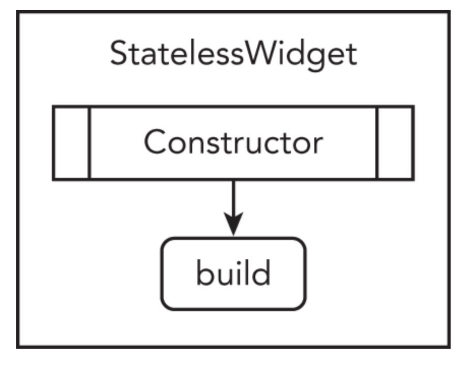
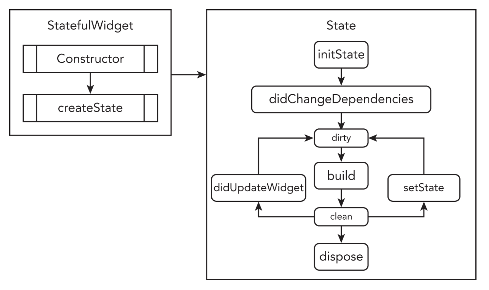
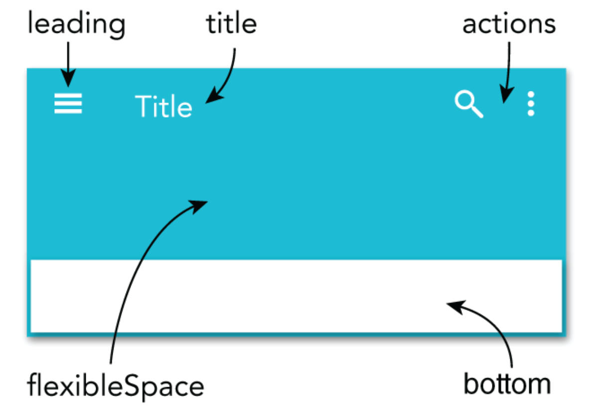

# 🏗️【Flutter Introduction 】.......〖In PROGRESS〗 🚧

come After Some Time :) :)

`TODO` Write Below Secription

> https://learning.oreilly.com/library/view/beginning-flutter/9781119550822/c01.xhtml

[](../../PlayGround/ResourcesFiles/Flutter_Dart/StateFulWidget.jpeg)

| [](https://twitter.com/andreasmehlsen) | [](https://github.com/andreasbm/readme/blob/master/CONTRIBUTING.md) |
| :-------------------------------------------------------------------------------------------------------------------------------------------------------------------: | :-------------------------------------------------------------------------------------------------------------------------------------------------------------------------------------: |
|                                                                           Stateless Widget                                                                            |                                                                                     StateFul Widget                                                                                     |


<br>
<p align="center"> 
</p>


---

- [Flutter Widgets Explained | Understand How Flutter Works!](https://www.youtube.com/watch?v=FU2Eeizo95o)

https://learning.oreilly.com/library/view/beginning-flutter/9781119550822/c05.xhtml

three ways to create a shallow widget tree by refactoring: with a constant, with a method, and with a widget class

- with a constant
- with a method, and
- with a widget class

To make the example code more readable and maintainable, you'll refactor major sections of the code into separate entities. You have multiple refactor options, and the most common techniques are constants, methods, and widget classes.

- https://www.youtube.com/watch?v=Xu92WAlf0vI

## Refactoring With A Constant

Refactoring with a constant initializes the widget to a `final` variable. This approach allows you to separate widgets into sections, making for better code readability. When widgets are initialized with a constant, they rely on the `BuildContext object of the parent widget`.

> **What does this mean?**
>
> **Every time the parent widget is redrawn, all the constants will also redraw their widgets**, so you can't do any performance optimization. The benefits of making the widget tree shallower are similar with both techniques.

The following sample code shows how to use a constant to initialize the container variable as final with the Container widget. You insert the container variable in the widget tree where needed.

```
        final container = Container(
        color: Colors.yellow,
        height: 40.0,
        width: 40.0,
        );
```

## Refactoring With A Method

Refactoring with a method returns the widget by calling the method name. The method can return a value by a general `widget` (Widget) or a `specific widget` (Container, Row, and others).

The widgets initialized by a method rely on the `BuildContext object of the parent widget`. There could be _unwanted side effects_ if these kinds of methods are nested and call other nested methods/functions. Since each situation is different, do not assume that using methods is not a good choice. This approach allows you to separate widgets into sections, making for better code readability. However, **like when refactoring with a constant, every time the parent widget is redrawn, all the methods will also redraw their widgets. That means the widget tree is not optimizable for performance**.

The following sample code shows how to use a method to return a Container widget. This first method returns the Container widget as a general Widget, and the second method returns the Container widget as a Container widget. Both approaches are acceptable. You insert the `_buildContainer()` method name in the widget tree where needed.

> **What is the benefit of using the method approach?**
>
> The benefit is pure and simple code readability, but you lose the benefits of Flutter's subtree rebuilding: **performance**.

```
    // Return by general Widget Name
    Widget _buildContainer() {
    return Container(
    color: Colors.yellow,
    height: 40.0,
    width: 40.0,
    );
    }


    // Or Return by specific Widget like Container in this case
    Container _buildContainer() {
    return Container(
    color: Colors.yellow,
    height: 40.0,
    width: 40.0,
    );
    }
```

<!-- ## REFACTORING WITH A CONSTANT -->

> ⛽️ `_` front of any constant/method/class means its a `private` in dart
>
> `Eg : _buildHorizontalRow()`

> **How It Works ?**
>
> Creating a shallow widget tree means each widget is separated into its own method by functionality. Keep in mind that how you separate widgets will be different depending on the functionality needed. Separating widgets by method improves code readability, but you lose the performance benefits of Flutter's subtree rebuilding. _**All the widgets in the method rely on the parent's BuildContext, meaning every time the parent is redrawn, the method is also redrawn.**_

---

## Refactoring With A Widget Class

Refactoring with a widget class allows you to create the widget by `subclassing the StatelessWidget class`. You can create reusable widgets within the current or separate Dart file and initiate them anywhere in the application. **`Notice that the constructor starts with a const keyword, which allows you to cache and reuse the widget.`** When calling the constructor to initiate the widget, use the constkeyword. By calling with the const keyword, the widget does not rebuild when other widgets change their state in the tree. **If you omit the const keyword**, the widget will be called every time the parent widget redraws.

The widget class relies on its own **BuildContext**, not the parent like the constant and method approaches. BuildContext is responsible for handling the location of a widget in the widget tree.

> **What does this mean?**
>
> Every time the parent widget is redrawn, all the widget classes will **not redraw**. They are built only once, which is great for performance optimization.

The following sample code shows how to use a widget class to return a Container widget. You insert the constContainerLeft() widget in the widget tree where needed. **Note the use of the const keyword to take advantage of caching.**

```
class ContainerLeft extends StatelessWidget {
 const ContainerLeft({
  Key key,
 }) : super(key: key);

 @override
 Widget build(BuildContext context) {
  return Container(
   color: Colors.yellow,
   height: 40.0,
   width: 40.0,
  );
 }
}

// Call to initialize the widget and note the const keyword
const ContainerLeft(),
```

**What is the benefit of using the widget classes?**

It's pure and simple performance during screen updates. When calling a widget class, you need to use the const declaration; **otherwise**, it will be rebuilt every time, without caching.


# Using Common Widgets

<br>
<p align="center"> 
</p>
