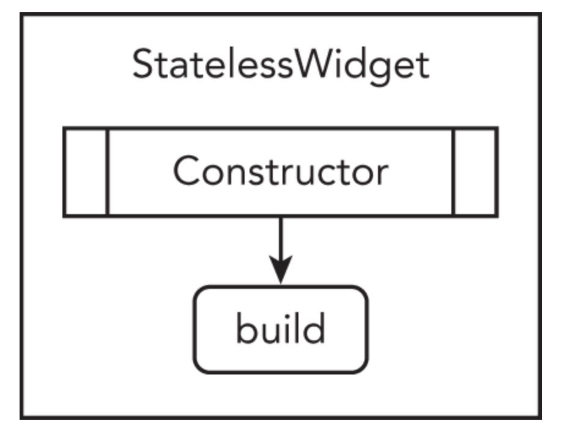
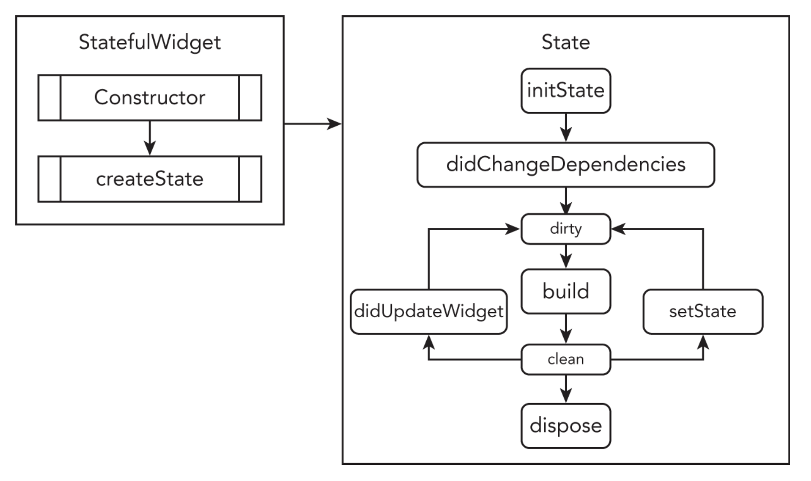
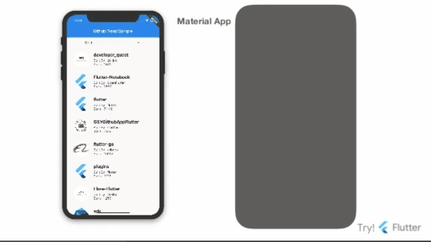

# 🏗️【Flutter Introduction 】.......〖In PROGRESS〗 🚧

come After Some Time :) :)

`TODO` Write Below Secription

> https://learning.oreilly.com/library/view/beginning-flutter/9781119550822/c01.xhtml

|  |  |
| :------------------------------------------------------------------------------------------------------------------------------------------------------------------: | :------------------------------------------------------------------------------------------------------------------------------------------------------------------------------------: |
|                                                                           Stateless Widget                                                                           |                                                                                    StateFul Widget                                                                                     |

 

 

---

https://learning.oreilly.com/library/view/beginning-flutter/9781119550822/c05.xhtml

three ways to create a shallow widget tree by refactoring: with a constant, with a method, and with a widget class

- with a constant
- with a method, and
- with a widget class

To make the example code more readable and maintainable, you'll refactor major sections of the code into separate entities. You have multiple refactor options, and the most common techniques are constants, methods, and widget classes.

## Refactoring With A Constant

<!-- ## REFACTORING WITH A CONSTANT -->

---
