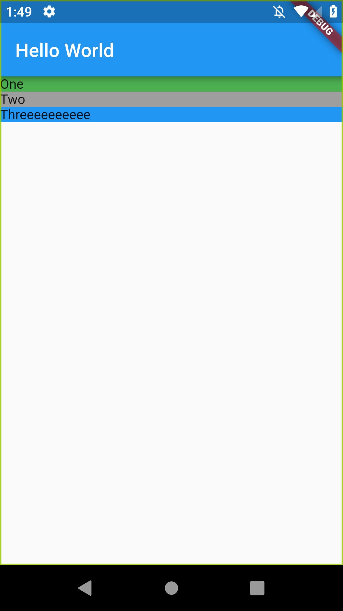

Tuto
Add three colored boxes to the screen.
Layout each box from top to bottom, with each item stretched.


# Container
"A convenience widget that combines common painting, positioning, and sizing widgets." (source) It’s basically the “<div>” of Flutter. 
Each Container has a “child” element, which allows us to nest elements. 
Let’s specify a “decoration”, allowing us “to paint behind the child.” in order to set the background color. We assign it a BoxDecoration. "The BoxDecoration class provides a variety of ways to draw a box." (source)
“Color” is a class that provides predefined colors for us. Each member being static and const. “static” values are available on the class itself, rather than a class instance. “const” is a value that is defined at compile time and cannot change when the app is running.
Now let’s a column based layout.


- Layout : https://fluttercrashcourse.com/lessons/stateless-widgets


<p align="center"> 
    
 </p>


```

import 'package:flutter/material.dart';

void main() {
  runApp(MaterialApp(
      home: Scaffold(
          appBar: AppBar(
            title: Text("Hello World"),
          ),
          body: Column(
            mainAxisAlignment: MainAxisAlignment.start,
            crossAxisAlignment: CrossAxisAlignment.stretch,
            children: <Widget>[
              Container(
                decoration: BoxDecoration(color: Colors.green[500]),
                child: Text("One"),
              ),
              Container(
                decoration: BoxDecoration(color: Colors.grey[500]),
                child: Text("Two"),
              ),
              Container(
                decoration: BoxDecoration(color: Colors.blue[500]),
                child: Text("Threeeeeeeeee"),
              ),
            ],
          ))));
}


```


