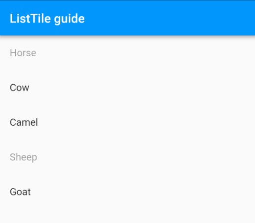

A ListTile is generally what you use to populate a ListView in Flutter


## a.   title

The title can take any widget, but it is generally going to be a Text widget.

```
ListTile(
  title: Text('Horse'),
)
```
<p align="center"> 
    
 </p>

## b.   subtitle
The subtitle is smaller text below the title.

```
ListTile(
  title: Text('Horse'),
  subtitle: Text('A strong animal'),
)
```
<p align="center"> 
    
 </p>

## c.   dense
The dense parameter makes the text smaller and packs everything together.

```
ListTile(
  title: Text('Horse'),
  subtitle: Text('A strong animal'),
  dense: true,
)
```

<p align="center"> 
    
 </p>


## d.   leading
You can add an image or an icon to the start of the ListTile. This is usually a CircleAvatar or an Icon.


```
ListTile(
  leading: CircleAvatar(
    backgroundImage: NetworkImage(imageUrl),
  ),
  title: Text('Horse'),
)
```


 <p align="center"> 
    
 </p>

```
ListTile(
  leading: Icon(Icons.home),
  title: Text('House'),
)
```

 <p align="center"> 
    
 </p>

## e.   trailing
Setting the trailing places an image at the end of the ListTile. This is particularly useful for indicating a master-detail layout.

```
ListTile(
  title: Text('Horse'),
  trailing: Icon(Icons.keyboard_arrow_right),
)
```


 <p align="center"> 
    
 </p>


## f.   contentPadding
You can change how much the content is inset on the left and right (but not the top or bottom) by setting the contentPadding. The default is 16.0 but here we will set to 0.0:

```
ListTile(
  title: Text('Horse'),
  trailing: Icon(Icons.keyboard_arrow_right),
  contentPadding: EdgeInsets.symmetric(horizontal: 0.0),
)
```

 <p align="center"> 
    
 </p>

## g.   selected
If a ListTile is selected, the color of the text and icons become the theme’s primary color.

```

ListTile(
  title: Text('Horse'),
  trailing: Icon(Icons.keyboard_arrow_right),
  selected: true,
)
```

  <p align="center"> 
    
 </p>


## h.   Gesture recognition
ListTiles can detect taps or long presses if you include a callback for the onTap or onLongPress parameters. The splash animation is built in.

```
    ListTile(
    title: Text('Horse'),
    onTap: () {
        // do something
    },
    onLongPress: (){
        // do something else
    },
    )

```


  <p align="center"> 
    
</p>


## i.   enabled
You can disable gesture detection by setting enabled to false.
```
ListTile(
  title: Text('Horse'),
  onTap: () {
    // this will not get called
  },
  enabled: false,
)

```
<p align="center"> 
    
 </p>

## j.   ListTile.divideTiles
The static method divideTiles can be used to add a divider between the tiles. It is pretty faint. You have to look carefully.

```

ListView(
  children: ListTile.divideTiles(
      context: context,
      tiles: [
        ListTile(
          title: Text('Horse'),
        ),
        ListTile(
          title: Text('Cow'),
        ),
        ListTile(
          title: Text('Camel'),
        ),
        ListTile(
          title: Text('Sheep'),
        ),
        ListTile(
          title: Text('Goat'),
        ),
      ]
  ).toList(),
)

```
  <p align="center"> 
    
 </p>


## Supplemental code
Here is the code if you would like to play around with it some more.


  <p align="center"> 
    
 </p>


```
import 'package:flutter/material.dart';

void main() => runApp(MyApp());

class MyApp extends StatelessWidget {
  @override
  Widget build(BuildContext context) {
    return MaterialApp(
      debugShowCheckedModeBanner: false,
      title: 'My App',
      theme: ThemeData(
        primarySwatch: Colors.blue,
      ),
      home: Scaffold(
        appBar: AppBar(title: Text('ListTile guide')),
        body: BodyWidget(),
      ),
    );
  }
}

String horseUrl = 'https://i.stack.imgur.com/Dw6f7.png';
String cowUrl = 'https://i.stack.imgur.com/XPOr3.png';
String camelUrl = 'https://i.stack.imgur.com/YN0m7.png';
String sheepUrl = 'https://i.stack.imgur.com/wKzo8.png';
String goatUrl = 'https://i.stack.imgur.com/Qt4JP.png';

class BodyWidget extends StatelessWidget {
  @override
  Widget build(BuildContext context) {
    return ListView(
      children: <Widget>[
        ListTile(
          leading: CircleAvatar(
            backgroundImage: NetworkImage(horseUrl),
          ),
          title: Text('Horse'),
          subtitle: Text('A strong animal'),
          trailing: Icon(Icons.keyboard_arrow_right),
          onTap: () {
            print('horse');
          },
          selected: true,
        ),
        ListTile(
          leading: CircleAvatar(
            backgroundImage: NetworkImage(cowUrl),
          ),
          title: Text('Cow'),
          subtitle: Text('Provider of milk'),
          trailing: Icon(Icons.keyboard_arrow_right),
          onTap: () {
            print('cow');
          },
        ),
        ListTile(
          leading: CircleAvatar(
            backgroundImage: NetworkImage(camelUrl),
          ),
          title: Text('Camel'),
          subtitle: Text('Comes with humps'),
          trailing: Icon(Icons.keyboard_arrow_right),
          onTap: () {
            print('camel');
          },
          enabled: false,
        ),
        ListTile(
          leading: CircleAvatar(
            backgroundImage: NetworkImage(sheepUrl),
          ),
          title: Text('Sheep'),
          subtitle: Text('Provides wool'),
          trailing: Icon(Icons.keyboard_arrow_right),
          onTap: () {
            print('sheep');
          },
        ),
        ListTile(
          leading: CircleAvatar(
            backgroundImage: NetworkImage(goatUrl),
          ),
          title: Text('Goat'),
          subtitle: Text('Some have horns'),
          trailing: Icon(Icons.keyboard_arrow_right),
          onTap: () {
            print('goat');
          },
        ),
      ],
    );
  }
}

```


 -----


  


Reference 
- [A complete guide to Flutter’s ListTile](https://medium.com/@studymongolian/a-complete-guide-to-flutters-listtile-597a20a3d449)