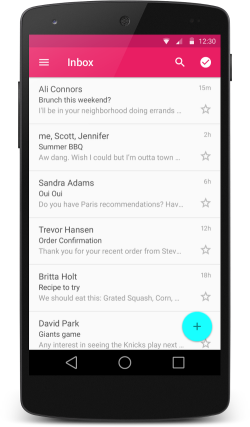
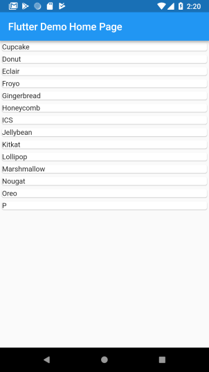
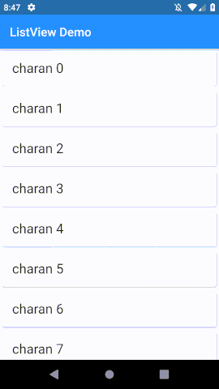
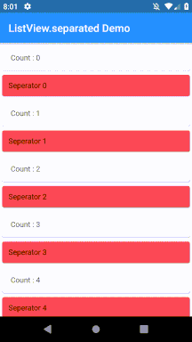

Exploring the ListView Widget and its Features in Depth

A ListView in Flutter is a linear list of scrollable items. We can use it to make a list of items scrollable or make a list of repeating items.

Lists: Working with a List or RecyclerView in Android meant writing a list item, an adapter and then attaching that adapter to the view in the layout file. This consumed a lot of time leading to slow development.

Flutter `simplifies` writing lists by eliminating most of the parts that took time in Android: No adapter, no separate list item, no attaching adapters to views.


# Introduction to ListView in Flutter
A list in Flutter is created using the ListView widget.

There are two types of lists:

1. User defines all items inside the list (Roughly equivalent to a ScrollView in Android)
2. User defines one item which is repeated across the list (Equivalent to a RecyclerView)


**Type I**

The first type of list is just a scrollable collection of items more than a true list. Here is an example use of the ListView:

```
ListView(
  children: <Widget>[
    Text("Element 1"),
    Text("Element 2")
  ],
),
```

Because the user defines each and every item in the list individually, this behaves more like a ScrollView than a ListView or RecyclerView in Android.

This type was just included here for completeness, we are going to focus on the second type of ListView.

**Type II**

<p align="center"> 
    
 </p>

The second type of list is a list `with repeating blocks with different data in each one`. To make a List like this, we use the `ListView.builder() constructor`.

Let’s take a look at an example ListView containing the list of Android version names:

```
ListView.builder(
      itemBuilder: (context, position) {
        return Card(
          child: Text(androidVersionNames[position]),
        );
      },
      itemCount: androidVersionNames.length,
)
```

<p align="center"> 
    
 </p>


# Exploring the types of ListView

We’ll start with looking at the types of ListViews and later look at the other features and neat modifications for it.

Let’s look at the types of ListViews there are:

1.  **ListView**
2.  **ListView.builder**
3.  **ListView.separated**
4.  **ListView.custom**


## 1.  ListView

This is the default constructor of the ListView class. A ListView simply takes a list of children and makes it scrollable.

The general format of the code is:
```
ListView(
  children: <Widget>[
    ItemOne(),
    ItemTwo(),
    ItemThree(),
  ],
),
```
Usually this should be used with a **`small number of children`** as the List will also construct the invisible elements in the list and a large amount of elements may render this inefficient.


## 2. ListView.builder()

The builder() constructor constructs a repeating list of items. The constructor takes two main parameters: An itemCount for the number of items in the list and an itemBuilder for constructed each list item.


There are two properties inside the builder, itemBuilder and itemCount

**itemCount** is pretty straightforward, it asks how many repeating items you want to display in the list.

**itemBuilder** is where you return the item itself that you want to display. Here we made a card with a simple text widget inside. Item builder expects a lambda function which has the parameters of context and position. Position gives you which index of the list it is.


In summary, when you make a list, you have to supply two things to it: 1) How many items in the list? 2) What does each item look like and what data does it contain?


The general format of the code is:

```
ListView.builder(
  itemCount: itemCount,
  itemBuilder: (context, position) {
    return listItem();
  },
),
```
The list items are constructed lazily, meaning only a specific number of list items are constructed and when a user scrolls ahead, the earlier ones are destroyed.

**Neat trick:** Since the elements are loaded lazily and only the needed number of elements are loaded, we don’t really need an itemCount as a compulsory parameter and the list can be infinite.


```
ListView.builder(
  itemBuilder: (context, position) {
    return Card(
      child: Padding(
        padding: const EdgeInsets.all(16.0),
        child: Text(position.toString(), style: TextStyle(fontSize: 22.0),),
      ),
    );
  },
),
```
<p align="center"> 
    
 </p>


## 3. ListView.separated()
In the separated() constructor, we generate a list and we can specify the separator between each item.

<p align="center"> 
    
 </p>


In essence, we **construct two interweaved lists**: one as the main list, one as the separator list.

Note that the infinite count discussed in the earlier constructor cannot be used here and this constructor enforces an itemCount.

The code for this type goes as:

```
  body: ListView.separated(
    itemBuilder: (context,position){
      return Card(
        child: Padding(
          padding: const EdgeInsets.all(16.0),
          child: Text("Count : $position"),
        ),
      );
    },
    separatorBuilder: (context,position){
      return Card(
        color: Colors.red,
        child: Padding(
          padding: const EdgeInsets.all(12.0),
          child: Text("Seperator $position"),
        ),
      );
    },
    itemCount: 10,
  ),

```

This type of list lets you dynamically define separators, have different types of separators for different types of items, add or remove separators when needed, etc.

This implementation can also be used for inserting other types of elements (advertisements for example) easily and without any modification to the main list in the middle of the list items.


**Note:** The separator list length is 1 less than the item list as a separator does not exist after the last element.

---

A more advanced example
To understand a real-world example, here’s a better looking demo ListView for an email app.


---


ListView Vs ListView.builder

The main difference between ListView and ListView.builder is that the default ListView constructor requires us to create all items at once whereas the ListView.builder constructor will create items as they are scrolled onto the screen like on demand.


# Examples : 
- [An example showing how we can tap on a ListTile to open a PopUpMenuButton in Flutter.](https://gist.github.com/MaskyS/987f85e7893b487e4575faef02f70c28)

# References 
- Basics : 
    - https://medium.com/@dev.n/the-complete-flutter-series-article-3-lists-and-grids-in-flutter-b20d1a393e39 : **Read** 
    -   https://medium.com/@studymongolian/a-complete-guide-to-flutters-listtile-597a20a3d449
- https://proandroiddev.com/flutter-thursday-02-beautiful-list-ui-and-detail-page-a9245f5ceaf0
- https://pusher.com/tutorials/flutter-listviews