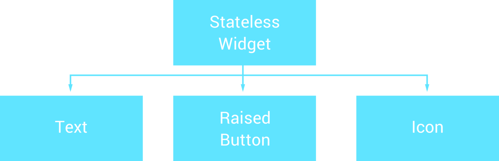
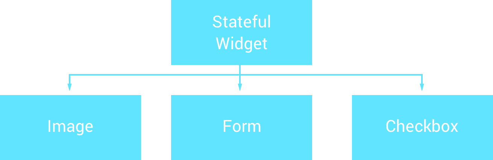
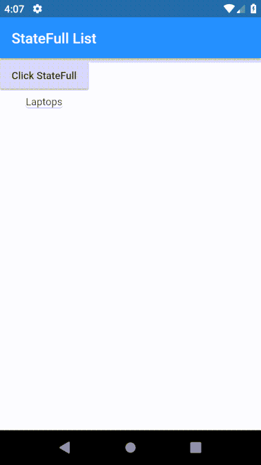

# Stateful or Stateless widgets

As We know in Flutter Everything you talk and everything you see is Widget :) 
When building Flutter applications we use widgets to construct our User Interface. When it comes to these widgets there is one of two types which it can be — either `stateful or stateless`. 

Here we take a look at these different types of widgets so that we can get a better understanding of them and know which one to use when it comes to defining our own widgets.

## Stateless widgets 
There are cases where you’ll create widgets that don’t need to manage any form of internal state, this is where you’ll want to make use of the StatelessWidget. This widget doesn’t require any mutable(`Liable to change`) state and will be used at times where other than the data that is initially passed into the object.

For example, we can look at several widgets that we know of which are stateless widgets:

 <p align="center"> 
    
 </p>

All three of these widgets here are just a few of the stateless widgets from the flutter widget catalog. **But what exactly makes these stateless?** To begin with, it really helps to dive into the source of these widgets . If we open up the source for say, the Text widget, we’ll notice that `there is no state of the widget which can be changed.` 

The Text widget is instantiated using a constructor and then these properties are used to build the widget to be displayed on the screen — `the parent widget is essentially in control of managing the state which is presented by this widget`.

 <p align="center"> 
    
 </p>

 So in the case of the Text widget — this is passed properties such as text, alignment, direction etc by it’s parent which it will then use as its configuration.

 But what if we’re creating our own widgets, when should we used a stateless widget? To think of a few examples:

- You may create a custom ProgressBar widget that just uses the properties which it is instantiated with to display progress to the user. This wouldn’t be holding any state as the parent widget might just be adding and removing it from the widget tree — in which case the parent is managing it’s own state of what is being shown and what is not.
- You may create an item widget to be used when displaying a list of some content to the user, for example a list of cakes where each cake is represented by this item widget. To this item widget you’ll pass in a Cake reference which will just be used to populate the content of the item widget. This item widget wouldn’t be saving state, again it is just using the data passed in by its parent to configure its display to the user.
	
From this we can see that a stateless widget is **not dynamic**. It doesn’t depend on any data other than that that is passed into it, meaning that the only way it can set how it is represented is when arguments are passed into it’s constructor.

## Stateful widgets

Now on the other hand, stateful widgets **are dynamic**. They allow us to create widgets which can dynamically change their content over time and don’t rely on static states which are passed in during their instantiation. This may change due to user input, some form of asynchronous response or reactively from another form of state change.

For example, we can look at several widgets that we know of which are stateful widgets:

 <p align="center"> 
    
 </p>


All three of these widgets here are just a `few of the stateful widgets` from the flutter widget catalog. **But what exactly makes these stateful?** 

To begin with, it really helps to dive into the source of these widgets. If we open up the source for say, the `Image` widget, we’ll notice that there is a slightly different look to the file. To begin with, our Image class extends from the StatefulWidget class.

 Now, just like the previous stateless widgets we look at, our Image constructor still takes in parameters for properties which are to be used by this class. However, the difference is here.

```
_ImageState createState() => new _ImageState();
```

This overriden function is used to create the state for our widget. Without going too into specifics about how the Image class works, you’ll notice that the _ImageState of this file is keep a reference to three different properties:

```
ImageStream _imageStream; 
ImageInfo _imageInfo; 
bool _isListeningToStream = false;
```

The ImageInfo property here is used to load the actual image for the widget. Now, there is a function here called `_handleImageChanged` which uses the `setState` function of the `State` class to essentially say “Hey, something has changed — we need to update our state!”.


```
image.dart in flutter

  void _handleImageChanged(ImageInfo imageInfo, bool synchronousCall) {
    setState(() {
      _imageInfo = imageInfo;
    });
  }
```

When this happens, the `widget is rebuilt with this new state in mind, meaning that the image for the updated imageInfo can be loaded.`

Here, the Image widget is `behaving in a dynamic manner` — it’s listening for a change of image reference and then updating it’s state once something changes, **therefore it is managing it’s own state and not relying on a parent widget to do so**. It’s worth diving into other Stateful widgets to see how they behave, this will also help you to understand better about when something should be either stateful for stateless. For some simple examples of when widgets may hold state:

- we will create a widget that represents whether or not an item has been bookmarked by our user. Here, our clickable view might hold a reference to isBookmarked — this state would then be set whenever the view is clicked, and the build function of our class would set the Icon based on the value of this isBookmarked field.
- Maybe we will have a widget that will keep a reference to the quantity of the current item being selected, where a ‘+’ icon would increment this value. Here our item widget would keep a quantity state, and every time the ‘+’ icon is pressed the state would be set for this value and the representation of this quantity would be updated within our build function.

### Example

#### Skeleton of Stateful Widget
Let Have A simple Example with a Stateful widget which changes in states when some action occured.

we will create a button widget, and when the button is pressed, it will add an item to the List and display that List on the mobile screen. So, when the button is pressed, the state of the widget will change, and the UI will be re-rendered, and we will see the products list inside the mobile screen.

```
class MyApp extends StatefulWidget {
  @override
  State<StatefulWidget> createState() {
    return _MyAppState();
  }
}

class _MyAppState extends State<MyApp> {
  @override
  Widget build(BuildContext context) {
    return Container(color: const Color(0xFFFFE306));
  }
}

```


So, here first, we have declared our main class called MyApp which extends the StatefulWidget class. That means now we have to define the generic method called createState() in that class.

Now, that method will return one another class which extends the State.

In our case, it is the _MyState class which extends the State. So all the coding related to state updation is inside this class.

#### createState method

It creates the mutable state for that widget at a given location in the tree. It is implemented by the following code.


```
@protected
State createState();
```


#### Example of Stateful Widget 
We are taking one example in which, we will add a button and a card. The card consists of one widget called Text. So when a user clicks on a button, it will add a new item to the list. So the state of the list is changed, and flutter will update its UI, and we will see the lists on the mobile screen.


 <p align="center"> 
    
 </p>


```
import 'package:flutter/material.dart';

void main() => runApp(MyApp());

class MyApp extends StatefulWidget {
  State<StatefulWidget> createState() {
    return _MyAppState();
  }
}

class _MyAppState extends State<MyApp> {
  List<String> _products = ['Laptops'];

  Widget build(BuildContext context) {
    return MaterialApp(
      home: Scaffold(
        appBar: AppBar(
          title: Text("StateFull List"),
        ),
        body: Column(children: <Widget>[
          Container(
            child: RaisedButton(
              onPressed: () {
                setState(() {
                  _products.add('Charan');
                });
              },
              child: Text('Click StateFull'),
            ),
          ),
          Column(
            children: _products
                .map((element) => Card(
                      child: Column(
                        children: <Widget>[Text(element)],
                      ),
                    ))
                .toList(),
          ),
        ]),
      ),
    );
  }
}

```

The List datatype is equivalent to an Array of the Javascript language. You can add, remove the items from the List.

Inside the _MyApp class, we have initialized one list called _products with one item called Laptop. So that is our state variable for this demo.

Now, when a user clicks on a button, it will call the setState() method, which will add the new item on the List and due to change in state, the flutter updates the UI, and we are iterating a card widget based on the list and see the text on the screen.


More examples [here](https://proandroiddev.com/flutter-a-hitchhiker-guide-to-stateless-and-stateful-widgets-cc9f9295253b) 

`MyTake`:
Its all about how the state of widget changes in lifetime of the flutter app


Refer : :heart:[**1**](https://appdividend.com/2018/12/16/how-to-create-stateful-widget-in-flutter/) , :heart: [**2**](https://kodestat.gitbook.io/flutter/flutter-buttons-and-stateful-widgets) , [3](https://flutterdoc.com/stateful-or-stateless-widgets-42a132e529ed) , [4](https://proandroiddev.com/flutter-a-hitchhiker-guide-to-stateless-and-stateful-widgets-cc9f9295253b)
