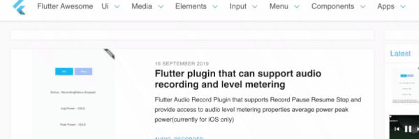

# Flutter

# All About Flutter Introduction

Flutter is Google's portable UI framework for building modern, native, and reactive applications for iOS and Android.
Google is also working on Flutter desktop embedding and Flutter for the Web (Hummingbird) and embedded devices (Raspberry Pi, home, automotive, and more). Flutter is an open‐source project hosted on GitHub with contributions from Google and the community. Flutter uses Dart, a modern object‐oriented language that compiles to native ARM code and production‐ready JavaScript code.

The Flutter UI is implemented by using widgets from a modern reactive framework. Flutter uses its own rendering engine to draw widgets.

# Types of Widget

We can split the Flutter widget into two categories:

- Visible (Output and Input)
- Invisible (Layout and Control)

# Basic

- [x] [Stateless Vs StateFul Widgets](./AllReadMe/StatelessvsStateFulWidgets.md)

# Flutter Catalog

- [ ] **Widgets**

  - [ ] Icon
  - [ ] text
  - [ ] [TextField](AllReadMe/TextField.md)
  - [ ] TextFormFeild
  - [ ] Image
  - [ ] Card,Inkwell
  - [ ] Buttons
  - [ ] DropdownButton,MenuButton
  - [ ] other stateful widgets

- [ ] **Layouts**

  - [ ] Container
  - [ ] Row,Column
  - [ ] Wrap
  - [ ] Expanded
  - [ ] Stack

- [ ] **Lists**

  - [ ] [ListTile](./AllReadMe/ListTile.md)
  - [ ] [ListView](./AllReadMe/ListView.md)
  - [ ] GridList
  - [ ] ExpansionTile
  - [ ] Swipe to dismiss
  - [ ] Reorderable list
  - [ ] Data Table

- [ ] **AppBar**

  - [ ] Basic AppBar
  - [ ] Bottom AppBar
  - [ ] Sliver AppBar
  - [ ] Search

- [ ] **Navigation**

  - [x] [Tabs](./AllReadMe/TabController.md#Tab)
  - [ ] Dialogs
  - [ ] Routes
  - [ ] Navigation Drawer
  - [ ] Bottom tab Bar
  - [ ] Bottom navigation Bar
  - [ ] Page Selector

* [ ] **Animation**

  - [ ] Opacity
  - [ ] Hero

* [ ] **Persistence**

  - [ ] Shared preference
  - [ ] local file read/write

* [ ] **State Management**

  - [ ] StreamBuilder(timer app)
  - [ ] StreamController
  - [ ] InheritWidget
  - [ ] ScopeModel
  - [ ] BLoc Pattern
  - [ ] Easier BLoc pattern

* [ ] **Plugins**

  - [ ] Image picker
  - [ ] Web View
  - [ ] Markdown rendering
  - [ ] Local auth

* [ ] **Firebase**

  - [ ] Firebase login
  - [ ] Firebase voting app
  - [ ] Chat room
  - [ ] Firebase ML Kit

* [ ] **Misc**
  - [ ] [Gesture](./AllReadMe/Gesture.md)
  - [ ] [BrushUp](./AllReadMe/BrushUp.md)
  - [ ] [AlertDialogue](./AllReadMe/AlertDialogue.md) :construction:
  - [ ] Toast
  - [ ] [Future](./AllReadMe/Future.md) :construction:
  - [ ] async
  - [ ] [Http](./AllReadMe/Http.md)
  - [ ] [DataBase](./AllReadMe/DataBase.md)
  - [ ] [Stack](./AllReadMe/Stack.md) :construction:

# Challengers

- [ ] Flutter App to display an hexagonal eqvivalent color in a small box while enetered in a text feild - [here](https://flutterawesome.com/convert-hexadecimal-colors-to-rgb-colors-and-vise-versa/)

- [ ] Clap like Medium - [here](https://proandroiddev.com/flutter-animation-creating-mediums-clap-animation-in-flutter-3168f047421e)

- [ ] Avatar generator - [here](https://github.com/tomwyr/avataaar-image)

- [ ] Calculator - [here](https://flutterawesome.com/a-simple-calculator-app-made-to-show-capablities-of-flutter/)

- [ ] Calculator Another - [here](https://github.com/praharshbhatt/Flutter_Calculator)
- [ ] [Projects and Series & Curriculum](https://busy.org/@tensor/building-custom-scroll-physics-and-simulations-with-dart-s-flutter-framework)

- [ ] [flutter_lessons ](https://github.com/lohanidamodar/flutter_lessons)
- [ ] [My Quiz App](./AllReadMe/MyQuizApp.md)

---

# Awesome Links

- :green_heart: https://flutterawesome.com/

    
 
     
  

- Essential Flutter Skills : https://hackernoon.com/essential-flutter-skills-2466d91d3926
- https://material.io/design/components/app-bars-top.html#anatomy
- https://kodestat.gitbook.io/flutter/
- http://tphangout.com/category/flutter/
- [flutter_ui_challenges](https://github.com/lohanidamodar/flutter_ui_challenges)

# Explore Examples:

- https://github.com/flutter/flutter/tree/master/examples
- [Apps that won FlutterCreate Contents](https://github.com/pinkeshdarji/FlutterCreateSubmissions2019/blob/master/README.md) :heart:
- [Flutter Thursday Series](https://medium.com/@afegbua/flutter-thursday-series-9564d04e63a7)
- [PageView](https://medium.com/flutter-community/a-deep-dive-into-pageview-in-flutter-with-custom-transitions-581d9ea6dded)
  - [TextFields](https://medium.com/flutter-community/a-deep-dive-into-flutter-textfields-f0e676aaab7a)
  - [FloatingActionButtons](https://proandroiddev.com/a-deep-dive-into-floatingactionbutton-in-flutter-bf95bee11627)
  - [Hero Widget](https://medium.com/flutter-community/a-deep-dive-into-hero-widgets-in-flutter-d34f441eb026)
  - [Transform Widget](https://medium.com/flutter-community/a-deep-dive-into-transform-widgets-in-flutter-4dc32cd575a9)
  - [Draggable/DragTarget](https://medium.com/flutter-community/a-deep-dive-into-draggable-and-dragtarget-in-flutter-487919f6f1e4)
  - [PageViews](https://medium.com/flutter-community/a-deep-dive-into-pageview-in-flutter-with-custom-transitions-581d9ea6dded)
- [Flutter – Phone Authentication](http://tphangout.com/flutter-phone-authentication/)
- [Flutter – Charts and Stopwatches ](http://tphangout.com/flutter-charts-and-stopwatches/)
- [Themes](https://startflutter.com/)

# yet to Make Notes

- [ ] Best Apps
  - [ ] :heart: [https://github.com/X-Wei/flutter_catalog](https://github.com/X-Wei/flutter_catalog)
- [ ] Links

  - [ ] [https://github.com/Solido/awesome-flutter](https://github.com/Solido/awesome-flutter)
  - [ ] [https://github.com/felangel/bloc](https://github.com/felangel/bloc)
  - [ ] Stateless Vs StateFull Widgets

    - https://flutter.dev/docs/development/ui/interactive
    - https://proandroiddev.com/flutter-a-hitchhiker-guide-to-stateless-and-stateful-widgets-cc9f9295253b

  - [ ] Text Input
    - https://flutterdoc.com/implementing-text-input-in-flutter-apps-3630afb49ecd
  - [ ] [Alert Dialogue](http://androidkt.com/flutter-alertdialog-example/)
  - [ ] Toast
    - https://stackoverflow.com/questions/45948168/how-to-create-toast-in-flutter
  - [ ] Flutter Layout
    - https://flutter.dev/docs/development/ui/layout
      - Rows and Columns
      - https://medium.com/jlouage/flutter-row-column-cheat-sheet-78c38d242041

# Tutorials :

## Level 1:

- [Understanding Basic Dart - dart by Example](http://jpryan.me/dartbyexample/)
- All Flutter Basic by [Flutter By RajaYogan](https://www.youtube.com/playlist?list=PLgGjX33Qsw-EMsLf8TmsYhKOCx2ALZiKi)

## Level 2:

This is for those who had or can create a basic flutter app up and running with minial understanding of flutter concepts

- Build and App step by step - [The Flutter Crash Course](https://www.youtube.com/watch?v=bPXFqQG66iAlist=PL__UlMMmv_ryxZun7zAdI8KWufcYLXA-_)

`Layout, Image,Constraints,BoxDecoration etc`

# Explore

- https://flutterbyexample.com/stateful-widget-lifecycle
- https://github.com/pinkeshdarji/FlutterCreateSubmissions2019/blob/master/README.md
- https://medium.com/@dev.n
- https://pub.dev/
- [All About Collections - The Spread operator (…) ,`if` in a Collection, `for` in a Collection](https://medium.com/flutter-community/whats-new-in-dart-2-3-1a7050e2408d)
