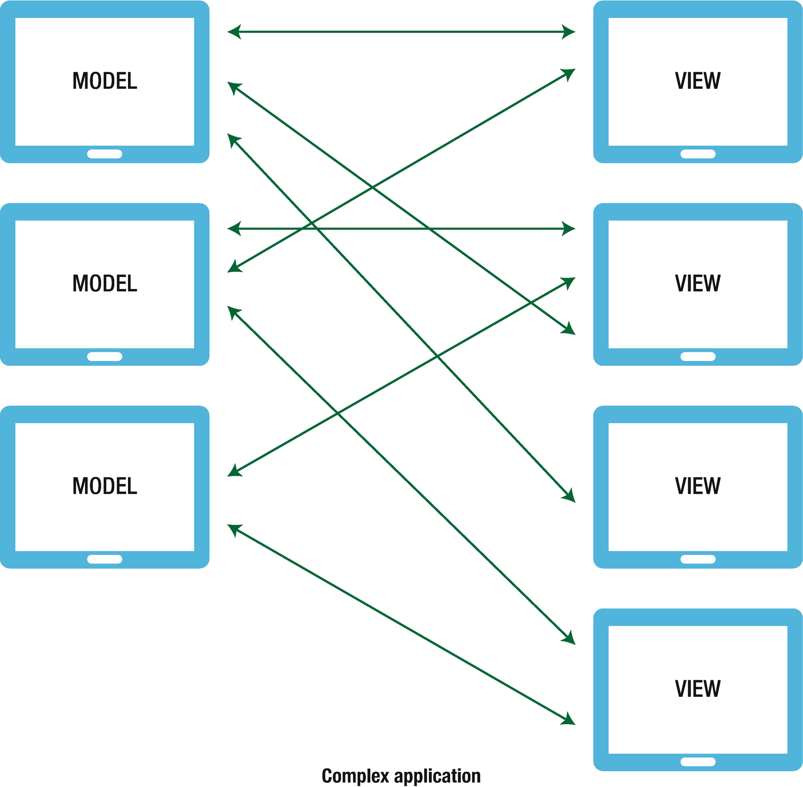
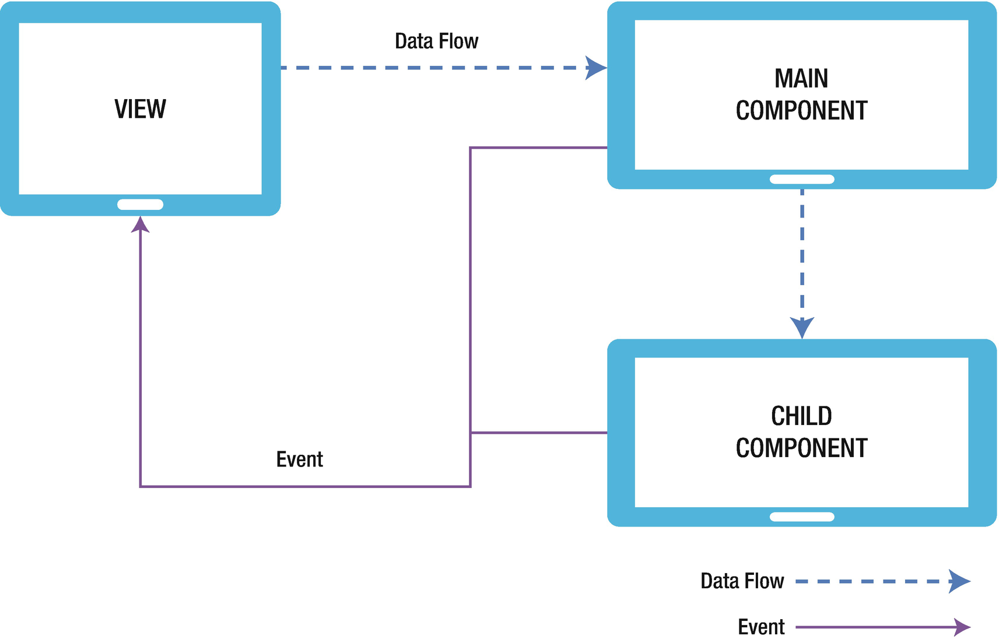

# 🏗️【React-Native Building 】.......〖In PROGRESS〗 🚧

come After Some Time :) :)

https://learning.oreilly.com/library/view/react-native-for/9781484244548/html/346704_2_En_1_Chapter.xhtml

React Js + React Native = React Native Mobile Apps

Javascript is the language we use to  build react native apps(Like Dart language for Flutter apps) with some special components like view,text wehich are not HTML components(because native platform doesnt understand html tags) 

i.e React Js + React Native => (compiled to) => Real Native apps

# Two-Way Data Flow vs One-Way Data Flow(React Way)

 

  

 

 

  

 

 

  

 

Components are the smallest units in React application development; they are indeed the most fundamental part of React. React is a library for building UIs and components are the key for creating any UI in React

> :fuelpump: `Compenents` in ReactNative is as `Widget` in Flutter

## Deep-Dive into Components

### PROPERTIES
