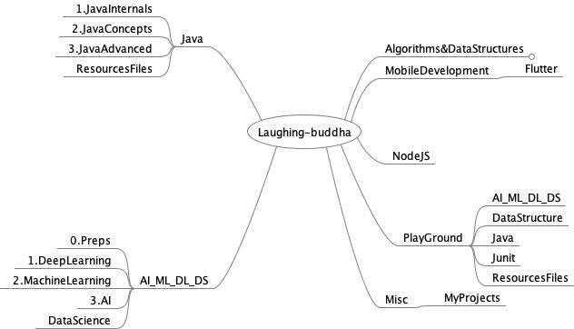

 

Table of Contents
=================

   * [Repo MindMap](#repo-mindmap)
      * [Algorithms&amp;DataStructures](#algorithmsdatastructures)
      * [Java](#java)
      * [AI_ML_DL_DS](#ai_ml_dl_ds)
      * [MobileDevelopment](#mobiledevelopment)
      * [NodeJS](#nodejs)
      * [Misc](#misc)
   * [<g-emoji class="g-emoji" alias="link" fallback-src="https://github.githubassets.com/images/icons/emoji/unicode/1f517.png">🔗</g-emoji>  Reference links](#link--reference-links)

# Repo MindMap

  
 
    
 

## Algorithms&DataStructures

## Java 

## AI_ML_DL_DS

## MobileDevelopment

## NodeJS

## Misc

# :link:  Reference links

For easy Access of links to Topics , I organized links in [References.csv](References.csv).

Search for any topic and you will get reference link for that topis...this makes easy for searching links out of many links .

  

 
 

 
<!--   -->

 
 

<!--   -->

<!--  -->

<!--  -->
<!--  -->
<!--  -->

<!--  -->

<!--  -->

<!--  -->

<!--  -->

<!--  -->

<!--  -->

<!--  -->

<!--  -->

<!--  -->

<!--  -->

<!-- 

 -->

<!-- 

 -->

<!-- 🏁 -->
<!-- 📃 -->